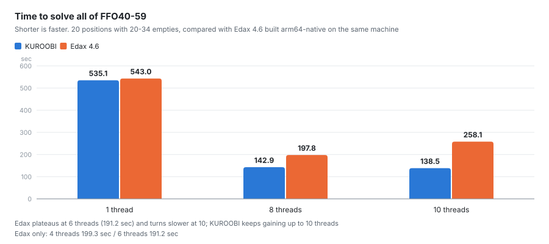

# 到達水準

対局成績・FFO ベンチマーク・並列化の計測。採らなかった施策も棄却理由ごと残してある。

## 到達水準

対局は Edax 4.5.5 (macOS では Rosetta 経由の x86 バイナリ)、終盤ベンチは
Edax 4.6 を arm64 ネイティブにビルドしたもの。いずれも単一スレッド。

### 対 Edax 対局

| 条件 | 相手 | 結果 |
|---|---|---|
| depth10 + solve22 (MPC なし) | level 11 | 46.5% (互角) |
| depth14 + solve22 + MPC | level 11 | **57.8%** (400局、有意) |
| depth16 + solve22 + MPC | level 13 | **53.9%** (800局、有意) |
| depth22 + 空き27完全読み + MPC、8 スレッド | level 24 | 49.0% (100局、互角) |

最後の行は 1 手あたり 0.5 秒前後で釣り合うよう組んだもの。

評価関数単体の質も、探索条件を揃えた 2200 局の比較で Edax 公式評価と
統計的に同等 (51.7%) であることを確認している。

### 総当たり戦 (評価関数の比較)

探索の作り込みではなく**評価関数**を比べるため、全エンジンを素の固定深度
8 手読みに揃えて総当たりした。8 手読みなら空き 8 以下の局面はそのまま
終局まで読み切るので、終盤の設定は別途要らない。定石なし、選択的枝刈り
なし、単一スレッド。開局 6 手をランダムに指し、先後を入れ替えて 2 局ずつ
指すので、どの組も同じ局面を両側から戦う。各組 100 局、計 600 局。

| 順位 | エンジン | 勝点 | 勝率 |
|---|---|---:|---:|
| 1 | Egaroucid 7.8 | 196.0 / 300 | **65.3%** |
| 2 | **当方** | 155.5 / 300 | **51.8%** |
| 3 | Edax 4.6 | 141.5 / 300 | 47.2% |
| 4 | Zebra (WZebra の思考エンジン) | 107.0 / 300 | 35.7% |

対戦成績 (行から見た 勝-負-分):

| | 当方 | Edax | Zebra | Egaroucid |
|---|---|---|---|---|
| **当方** | — | 52-43-5 (54.5%) | 56-39-5 (58.5%) | 41-56-3 (42.5%) |
| **Edax** | 43-52-5 | — | 57-36-7 (60.5%) | 33-62-5 (35.5%) |
| **Zebra** | 39-56-5 | 36-57-7 | — | 25-73-2 (26.0%) |
| **Egaroucid** | 56-41-3 | 62-33-5 | 73-25-2 | — |

Edax と Zebra には勝ち越し、Egaroucid には届かない。ただし 100 局での
54.5% は「互角〜やや優位」の幅で、明確な差と言うには局数が足りない。
Egaroucid に対する 42.5% と、Edax の 35.5%・Zebra の 26.0% を比べると、
当方は Egaroucid と Edax の中間にいる。

**Edax だけは条件を揃えるのに手を入れる必要があった。** level 表が中盤の
深度と終盤の完全読み開始点を連動させており、`-l 8` は「8 手読み + 空き
16 から完全読み」になって他エンジンより終盤だけ深くなる (`-depth` は
solve 用で対局には効かない)。そこで Edax に `EDAX_FIXED_DEPTH` という
環境変数を足し、立っていれば level 表を素の固定深度で埋めるようにした。
既定の挙動は変えていない。

対戦相手のビルドについて:

* **Zebra** は WZebra の思考エンジン (srczebra) を arm64 macOS へ移植した。
  必要だったのは 5 点 — `regparm` の無効化、静的変数 `wait` と `wait(2)` の
  名前衝突、`dir.h` (DOS 専用) を `unistd.h` へ、`rdtsc` を `cntvct_el0` へ、
  `windows.h` 経路を `CRON_SUPPORTED` で POSIX へ。加えて「この局面での
  最善手」を返す口が無かったので、engine 用の `main` を書き足した。評価係数
  と定石はソースに同梱されており、WZebra と同じデータで指す。
* **Egaroucid** は公式に ARM 向けオプションを持っており、
  `-DHAS_ARM_PROCESSOR=ON -DHAS_NO_AVX2=ON` で無修正でビルドできる。GTP を
  標準で話すのでそのまま繋がる。

対局ドライバは `src/bin/roundrobin.rs`。

### NNUE の微調整 — MSE の下がり方には棋力に効く帯と効かない帯がある

収束済みの NNUE を低い学習率で回し直すと val MSE はまだ下がる。**どこまで
下げれば棋力になるのか**を、新旧の直接対戦 (深さ 6、定石なし、開局 6 手
ランダム、先後入れ替え) で 2 世代ぶん測った。

| 世代 | val MSE | 相手 | 局数 | 勝率 (95% CI) | 石差 | 採否 |
|---|---:|---|---:|---|---:|---|
| 第 2 世代 | 32.64 → **31.94** | 旧出荷 | 1600 | **53.5%** (51.1..56.0) | +1.47 | 採用 |
| 第 3 世代 | 31.94 → **31.74** | 第 2 世代 | 1600 | 50.1% (47.6..52.5) | +0.16 | 採用 |
| 第 4 世代 | 31.74 → **31.05** | 第 3 世代 | 1596 | 52.3% (49.9..54.8) | +0.79 | 採用 |

第 2 世代の 0.70 の改善は +1.47 石になったが、続く 0.20 は 0 石だった。
**当てはまりの改善が指し手の差に変換されなくなる点がある。**

**第 3 世代は「棋力が上がらない」だけで「下がってもいない」ので採用した。**
CI が ±2.5pt まで縮んだうえでの五分なので、悪化が隠れている余地は小さい。
MSE が低い方が学習データへの当てはまりは確実に良く、棋力を損ねない以上、
採らない理由がない。

**これは「効果がなければ残さない」(CLAUDE.md 規約 1) の対象外。** 規約 1 は
**複雑さや実行時コストを足す施策**のためのもので、効果が無いなら足した分が
そのまま損になる。重みファイルの差し替えはどちらも足さないので、天秤に
乗るものが違う。

**第 4 世代は lr を下げ切っただけで得た。** 学習させたのではなく、**SGD の
揺らぎを消した**。1e-6 → 3e-7 → 1e-7 → 3e-8 → 1e-8 → 3e-9 と鎖状に繋ぎ、
各段 1〜2 エポックで打ち切る (どの lr でも 1〜2 エポック目が最良で、以降は
必ず悪化する)。改善幅は **−0.519 → −0.126 → −0.038 → −0.013** と毎回およそ
1/3 になり、等比外挿すると**極限は 31.04**。

「学習ではなく揺らぎ」と言い切れる根拠が 2 つある。

* **lr を下げるほど単調に良くなる。** 5e-5 は開始値より悪化し、1e-6, 1e-7,
  1e-8 と下げるほど良い。学習が進んでいるなら最適な lr が中間にあるはず
* **1 エポックあたりのデータを増やすと悪化する。** 同じ lr で 260M/epoch が
  31.09、750M/epoch が 31.15。効くのは学習量ではなく**総移動距離**
  (lr × 更新回数) で、少ないほど良い

つまり**モデルは既に最適点に居て、SGD はその周りを lr に比例した半径で
彷徨っていた**だけ。出荷していた重みはその雲の中の一点にすぎず、lr を
絞ることで中心へ寄せた。これが plain SGD で H=16 が到達できる底である。

副産物として分かったこと:

* **400 局では足りない。** 第 2 世代は 400 局だと 54.2% (49.4..59.1) で
  有意差が出なかった。勝率の点推定はほぼ同じで、CI が広いだけだった。
  MSE 1 未満の改良を測るなら最初から 1600 局を積む
* **収束済みモデルの微調整は「最良エポックを拾う」が必須。** どの lr でも
  1〜2 エポック目が最良で、以降は単調に悪化する。決め打ちのエポック数で
  回して最後の重みを採ると、必ず損をする
* **微調整の出力は対称化し直す。** 学習は 8 対称形を平均した誤差を見て
  いるが、重み自身は対称に保たれない。対称化で MSE も僅かに下がる
  (31.99 → 31.94)
* `nnue_arena` は逐次なので 1600 局に約 7 時間かかる。seed を変えた 8
  プロセスに分けると 2 時間弱で済む

### FFO ベンチマーク (終盤完全読み)

FFO テスト 1〜59 (空きマス 6〜34) を Edax と 1 問ずつ突き合わせた。
**両者とも同じマシンで arm64 ネイティブにビルドし、単一スレッド、
置換表のエントリ数を揃えて**、交互に走らせた最小値を採っている。
値は全問正解 (Edax と完全一致)。★ は当方が Edax のノード数を下回った問題
(38/59)。t比の「—」は Edax 側の時間が丸めで 0 になり算出不能。

**計測条件** (再現・比較のため明記):

| 項目 | 内容 |
|---|---|
| CPU / RAM | Apple M1 Max (高性能 8 + 高効率 2 = 10 コア) / 64 GB |
| OS | macOS 26.5.1 |
| 当方 | Rust 1.92.0、arm64 ネイティブ、`solve_obf --hash-bits 25 --threads 1`、`tools/pgo-build.sh` でビルド |
| Edax | 4.6 を `make build ARCH=native OS=osx COMP=clang` で arm64 ネイティブ化、`-solve -level 60 -n 1 -h 26` |
| 置換表 | **両者ともエントリ数 2^26 に統一**。当方 24 B/エントリ 2-way、Edax 24 B/エントリ 4-way |

当方の `--hash-bits N` は内部で 2 倍して 2^(N+1) エントリを確保するのに対し、
Edax の `-h N` は 2^N エントリそのもの。エントリ数を揃えるには当方を
1 つ小さく (25 対 26) する。また Edax は `-level 60` を付けないと 87% の
選択的探索になり完全読みにならない。

**Edax の実測値は熱状態で 5% 動く** (冷えた状態で FFO40-59 が 527 秒、
連続測定後は 543〜549 秒)。過去の測定値を固定の基準として持ち回らず、
比較のたびに同一セッションで両者を交互に走らせること。

#### 集計

| 集合 | 当方 | Edax | 時間比 | 当方ノード | Edaxノード | ノード比 | 当方NPS | EdaxNPS |
|---|---:|---:|---:|---:|---:|---:|---:|---:|
| FFO1-19 (空き 14-16) † | 0.073 秒 | 0.05 秒 | 1.46 | 2.1M | 3.0M | 0.71 | 29.0M | 60.6M |
| FFO20-39 (空き 6-22) † | 3.48 秒 | 2.36 秒 | 1.47 | 103.9M | 111.4M | 0.93 | 29.8M | 47.2M |
| **FFO40-59 (空き 20-34)** | **535.1 秒** | **542.99 秒** | **0.97** | **12.62G** | **25.39G** | **0.50** | **23.6M** | **46.7M** |
| **FFO1-59 合計** | **538.7 秒** | **552.8 秒** | **0.97** | **12.72G** | **25.50G** | **0.50** | **23.6M** | **46.1M** |

> **FFO40-59 の局面集は同梱していない** (容量の都合)。手元で再現するには
> 別途用意する。`bench/` にあるのは `band22` / `band29` / `band29v2` /
> `calib1030`。

**1 ノードあたりの速度は Edax の約半分 (23.6M 対 46.1M NPS)**。それでも
総時間で上回るのは、探索木がちょうど半分 (0.50) だから。この 2 つが
打ち消し合っているのが現在の均衡で、どちらか一方だけを見ても実力は測れない。

† 浅い 2 集合の当方の時間は**表を局面規模に合わせて**測っている
(FFO1-19 は `--hash-bits 20`、FFO20-39 は `--hash-bits 22`)。2^26 のままだと
1 局面あたり約 18 ms の置換表消去が乗り、探索本体を覆い隠す (0.41 秒 /
3.71 秒 になる)。Edax は置換表を消去しないのでこの費用を払わない。詳細は次節。

難問ほど当方が有利という構図で、**探索木は Edax の半分**、1 ノードあたりの
速度では Edax が上回る。両者が拮抗するのは、木の小ささとノード単価の差が
ちょうど相殺するため。

#### 浅い集合の数字は置換表の消去を測っている

FFO1-19 の 8.7 倍という比は**探索の差ではない**。当方は 1 局面ごとに
置換表を全消去するが、**Edax は消去しない** — 消去要求は日付
カウンタを 1 増やすだけで、実際のゼロ埋めは 127 局面に
1 度しか起きない。参照は日付を見ず盤面の一致だけで判定し、
日付は追い出しの優先度にのみ使われる。

2^26 エントリ = 1.6 GB のゼロ埋めは 1 局面あたり約 18 ms。空き 14 の
問題では探索本体が 20 マイクロ秒程度しかないので、これが時間の 84% を
占めてしまう。**表を局面規模に合わせれば消える**:

| 集合 | 表 2^26 | 表を縮小 | Edax |
|---|---:|---:|---:|
| FFO1-19 | 0.41 秒 | **0.073 秒** (`--hash-bits 20`) | 0.05 秒 |
| FFO20-39 | 3.71 秒 | **3.48 秒** (`--hash-bits 22`) | 2.36 秒 |

消去せず日付で世代管理する方式も実装して計測したが、**FFO40-59 が
5.7% 悪化した**ので採用していない。内訳は世代管理のコード自体が 2.5%
(探索は完全に同一で 12,618,873,806 ノードが一致、追い出し判定に比較が
1 つ増える分)、消去をやめたこと自体が約 3%。`update` は 1 局面あたり
1 億回以上呼ばれるので、この経路に足した命令はそのまま効いてくる。
深い局面を主戦場とする以上、消去する側が正しい。

#### 問題ごとの明細

| FFO | 空 | 値 | 当方ノード | Edaxノード | N比 | 当方秒 | Edax秒 | t比 | 当方NPS | EdaxNPS |
|---:|---:|---:|---:|---:|---:|---:|---:|---:|---:|---:|
| 1 | 14 | +18 | 49,285 | 63,433 | 0.78 ★ | 0.005 | 0.002 | 2.50 | 9.9M | 31.7M |
| 2 | 14 | +10 | 26,665 | 32,443 | 0.82 ★ | 0.002 | 0.001 | 2.00 | 13.3M | 32.4M |
| 3 | 14 | +2 | 94,370 | 135,736 | 0.70 ★ | 0.003 | 0.003 | 1.00 | 31.5M | 45.2M |
| 4 | 14 | +0 | 35,913 | 36,831 | 0.98 ★ | 0.002 | 0.001 | 2.00 | 18.0M | 36.8M |
| 5 | 14 | +32 | 14,159 | 12,718 | 1.11 | 0.001 | 0.000 | — | 14.2M | — |
| 6 | 14 | +14 | 85,287 | 60,849 | 1.40 | 0.003 | 0.002 | 1.50 | 28.4M | 30.4M |
| 7 | 14 | +8 | 24,271 | 22,373 | 1.08 | 0.001 | 0.001 | 1.00 | 24.3M | 22.4M |
| 8 | 15 | +8 | 251,397 | 255,020 | 0.99 ★ | 0.006 | 0.004 | 1.50 | 41.9M | 63.8M |
| 9 | 15 | -8 | 42,575 | 66,086 | 0.64 ★ | 0.002 | 0.002 | 1.00 | 21.3M | 33.0M |
| 10 | 15 | +10 | 88,848 | 116,329 | 0.76 ★ | 0.003 | 0.002 | 1.50 | 29.6M | 58.2M |
| 11 | 15 | +30 | 70,280 | 69,184 | 1.02 | 0.003 | 0.002 | 1.50 | 23.4M | 34.6M |
| 12 | 15 | -8 | 96,167 | 102,410 | 0.94 ★ | 0.003 | 0.002 | 1.50 | 32.1M | 51.2M |
| 13 | 16 | +14 | 84,556 | 101,311 | 0.83 ★ | 0.003 | 0.003 | 1.00 | 28.2M | 33.8M |
| 14 | 16 | +18 | 143,615 | 99,279 | 1.45 | 0.005 | 0.002 | 2.50 | 28.7M | 49.6M |
| 15 | 16 | +4 | 162,173 | 297,103 | 0.55 ★ | 0.004 | 0.006 | 0.67 | 40.5M | 49.5M |
| 16 | 16 | +24 | 316,212 | 213,597 | 1.48 | 0.010 | 0.004 | 2.50 | 31.6M | 53.4M |
| 17 | 16 | +8 | 21,929 | 34,178 | 0.64 ★ | 0.002 | 0.001 | 2.00 | 11.0M | 34.2M |
| 18 | 16 | -2 | 270,628 | 205,052 | 1.32 | 0.008 | 0.005 | 1.60 | 33.8M | 41.0M |
| 19 | 16 | +8 | 237,667 | 196,103 | 1.21 | 0.007 | 0.004 | 1.75 | 34.0M | 49.0M |
| 20 | 6 | +6 | 22 | 271 | 0.08 ★ | 0.007 | 0.000 | — | 0.0M | — |
| 21 | 15 | +0 | 186,004 | 240,991 | 0.77 ★ | 0.007 | 0.003 | 2.33 | 26.6M | 80.3M |
| 22 | 17 | +2 | 588,382 | 553,734 | 1.06 | 0.018 | 0.012 | 1.50 | 32.7M | 46.1M |
| 23 | 18 | +4 | 554,755 | 462,584 | 1.20 | 0.018 | 0.011 | 1.64 | 30.8M | 42.1M |
| 24 | 19 | +0 | 880,446 | 1,314,519 | 0.67 ★ | 0.026 | 0.028 | 0.93 | 33.9M | 46.9M |
| 25 | 19 | +0 | 2,935,305 | 4,380,945 | 0.67 ★ | 0.070 | 0.084 | 0.83 | 41.9M | 52.2M |
| 26 | 20 | +0 | 5,579,393 | 11,581,885 | 0.48 ★ | 0.154 | 0.232 | 0.66 | 36.2M | 49.9M |
| 27 | 20 | -2 | 2,386,238 | 1,749,257 | 1.36 | 0.074 | 0.043 | 1.72 | 32.2M | 40.7M |
| 28 | 20 | +0 | 6,286,199 | 9,685,208 | 0.65 ★ | 0.163 | 0.175 | 0.93 | 38.6M | 55.3M |
| 29 | 20 | +10 | 1,826,318 | 982,419 | 1.86 | 0.061 | 0.026 | 2.35 | 29.9M | 37.8M |
| 30 | 20 | +0 | 1,694,553 | 2,715,654 | 0.62 ★ | 0.056 | 0.058 | 0.97 | 30.3M | 46.8M |
| 31 | 20 | -2 | 3,184,137 | 2,029,626 | 1.57 | 0.100 | 0.048 | 2.08 | 31.8M | 42.3M |
| 32 | 20 | -4 | 7,462,178 | 5,600,088 | 1.33 | 0.180 | 0.114 | 1.58 | 41.5M | 49.1M |
| 33 | 20 | -8 | 8,378,891 | 4,757,407 | 1.76 | 0.232 | 0.105 | 2.21 | 36.1M | 45.3M |
| 34 | 20 | -2 | 8,583,592 | 8,067,390 | 1.06 | 0.227 | 0.138 | 1.64 | 37.8M | 58.5M |
| 35 | 21 | +0 | 1,608,335 | 4,424,179 | 0.36 ★ | 0.064 | 0.091 | 0.70 | 25.1M | 48.6M |
| 36 | 21 | +0 | 10,102,519 | 8,030,367 | 1.26 | 0.276 | 0.156 | 1.77 | 36.6M | 51.5M |
| 37 | 22 | -20 | 23,732,865 | 21,107,036 | 1.12 | 0.844 | 0.521 | 1.62 | 28.1M | 40.5M |
| 38 | 24 | +4 | 15,800,731 | 23,128,707 | 0.68 ★ | 0.740 | 0.496 | 1.49 | 21.4M | 46.6M |
| 39 | 26 | +64 | 2,094,697 | 393,603 | 5.32 | 0.120 | 0.016 | 7.50 | 17.5M | 24.6M |
| 40 | 20 | +38 | 9,373,569 | 10,871,279 | 0.86 ★ | 0.298 | 0.218 | 1.37 | 31.5M | 49.9M |
| 41 | 22 | +0 | 14,992,276 | 23,776,974 | 0.63 ★ | 0.442 | 0.463 | 0.95 | 33.9M | 51.4M |
| 42 | 22 | +6 | 21,605,765 | 26,627,982 | 0.81 ★ | 0.570 | 0.580 | 0.98 | 37.9M | 45.9M |
| 43 | 23 | -12 | 25,614,451 | 69,140,391 | 0.37 ★ | 1.050 | 1.806 | 0.58 | 24.4M | 38.3M |
| 44 | 23 | -14 | 27,866,862 | 20,331,907 | 1.37 | 1.044 | 0.507 | 2.06 | 26.7M | 40.1M |
| 45 | 24 | +6 | 159,587,707 | 269,563,518 | 0.59 ★ | 5.937 | 6.212 | 0.96 | 26.9M | 43.4M |
| 46 | 24 | -8 | 30,859,212 | 58,851,351 | 0.52 ★ | 1.306 | 1.304 | 1.00 | 23.6M | 45.1M |
| 47 | 25 | +4 | 13,470,849 | 15,908,913 | 0.85 ★ | 0.500 | 0.356 | 1.40 | 26.9M | 44.7M |
| 48 | 25 | +28 | 108,619,601 | 140,881,999 | 0.77 ★ | 5.167 | 3.820 | 1.35 | 21.0M | 36.9M |
| 49 | 26 | +16 | 110,488,125 | 314,841,257 | 0.35 ★ | 5.311 | 7.469 | 0.71 | 20.8M | 42.2M |
| 50 | 26 | +10 | 412,662,918 | 1,016,810,102 | 0.41 ★ | 24.603 | 25.391 | 0.97 | 16.8M | 40.0M |
| 51 | 27 | +6 | 154,541,093 | 266,257,527 | 0.58 ★ | 6.846 | 5.916 | 1.16 | 22.6M | 45.0M |
| 52 | 27 | +0 | 173,097,396 | 527,248,112 | 0.33 ★ | 6.304 | 11.869 | 0.53 | 27.5M | 44.4M |
| 53 | 28 | -2 | 1,063,132,194 | 2,662,837,881 | 0.40 ★ | 38.669 | 54.335 | 0.71 | 27.5M | 49.0M |
| 54 | 28 | -2 | 2,279,981,788 | 4,297,602,280 | 0.53 ★ | 77.922 | 82.302 | 0.95 | 29.3M | 52.2M |
| 55 | 29 | +0 | 5,879,384,139 | 11,267,921,720 | 0.52 ★ | 258.616 | 244.959 | 1.06 | 22.7M | 46.0M |
| 56 | 29 | +2 | 537,331,814 | 1,333,827,459 | 0.40 ★ | 27.021 | 29.457 | 0.92 | 19.9M | 45.3M |
| 57 | 30 | -10 | 982,262,488 | 1,230,860,828 | 0.80 ★ | 41.511 | 33.305 | 1.25 | 23.7M | 37.0M |
| 58 | 30 | +4 | 609,435,769 | 1,835,207,430 | 0.33 ★ | 31.613 | 40.029 | 0.79 | 19.3M | 45.8M |
| 59 | 34 | +64 | 4,565,790 | 1,881,623 | 2.43 | 0.411 | 0.088 | 4.67 | 11.1M | 21.4M |
| **計** | | | **12,724,855,363** | **25,504,576,438** | **0.50** | **538.7** | **552.8** | **0.97** | **23.6M** | **46.1M** |

代表的な難問の改善作業前後の推移:

| 問題 | 改善前 | 現在 |
|---|---|---|
| FFO#53 (空き28) | 6,282M / 763 秒 | 1,813M / 191 秒 |
| FFO#57 (空き30) | 8,088M / 1,492 秒 | 962M / 139 秒 |
| FFO#59 (空き34) | 19.3M / 8.0 秒 | 1.8M / 0.5 秒 |
| FFO#65 (空き28) | — | 2,264M / 282 秒 (Edax 10,236M / 951 秒) |

### 並列探索

置換表だけを共有し、他の探索状態はスレッドごとに独立させた YBWC
(Young Brothers Wait Concept)。厳密解は全スレッド数で逐次と一致する
(FFO40-49 を 1 スレッドと 10 スレッドで解いて、選択的・完全読みの両方で
値が一致することを確認している)。

> **値の一致だけでは足りない。** 「返す手」を取り違える欠陥が長らく残って
> いて、FFO も厳密解のテストも全部通ったまま実戦で 36 石を失った。
> 性質と直し方は [探索](search.md#並列探索の正しさ) に、検証の道具は
> [CLI ツール](cli.md#stress_par--stress_mid--stress_engine--stress_stop)
> にまとめてある。

FFO40-49 (474M ノード、値は決定論的、5 巡最小)。**置換表クリアは計測に
入れていない** — 問題を独立にするためのドライバ側の仕込みであり、探索では
ないし、`edax -solve` も Egaroucid の `-solve` も計時の外で呼んでいる:

| スレッド | 秒 | 速度比 | ノード膨張 |
|---:|---:|---:|---:|
| 1 | 20.672 | 1.00× | 1.00 |
| 4 | 7.999 | 2.58× | 1.20 |
| 6 | 5.751 | **3.59×** | 1.20 |
| 8 | 5.140 | **4.02×** | 1.34 |
| 10 | 4.450 | **4.65×** | 1.25 |

6 と 8 スレッドはノード数が巡ごとに二峰的で (8 スレッドで 635M〜760M)、
秒も 5.140〜6.384 と振れる。**この 2 点は最小値でも信用度が低い。**

10 スレッド 2.67× からここまでの改善は、すべて「分割の受け渡し・打ち切り
伝播・置換表の設計を 1 つずつ疑って計測で潰す」作業から出てきた。

#### 子 1 個が 1 タスク。予約はしない

**仕事の単位は若い兄弟 1 人。**`ybwc_split_nws` は探索しようとしている子を
毎回プールに渡そうとし、`push_task` が「いまアイドルなワーカーが居る」
(`n_idle > 0`、ロック前に 1 回・ロック後に再確認) ときだけ受け取って、
断ったことを呼び出し元に返す。断られたら親がその子を自分で読む。

当方は以前、分割点ごとに「ヘルパーを 2 本予約して OS スレッドを生成し、
兄弟リストを共有キューで取り合わせる」方式だった。これだと

- ヘルパーはリストが尽きるまでその 1 ノードに縛られる
- 予約が取れなかったノードは、他所でワーカーが遊んでいても単独で読む

の 2 つが同時に起きる。実測でも分割試行の 81% が予算切れで断られる一方
(分割 9,775 回に対し拒否 41,270 回)、平均では 10 スレッドのうち 6.4 本しか
存在していなかった。**プール化で稼働率は 66% → 82〜98% になった。**

#### per-node の上限は付けない方が速い

1 ノードが同時に外に出せる子の数に上限を付けると (FFO40-49、3 巡最小):

| 上限 | 6 スレッド | 10 スレッド |
|---:|---:|---:|
| 1 | 11.81 秒 | 11.85 秒 |
| 2 | 8.67 秒 | 8.44 秒 |
| 3 | 7.41 秒 | 6.85 秒 |
| 5 | 6.72 秒 | 6.71 秒 |
| **なし** | **6.26 秒** | **4.95 秒** |

上限 1 はノード数がいちばん少ない (550M 対 595M) のに 2.4 倍遅い。**投機を
抑えても、抑えた分だけ並列度が落ちて足が出る。**

#### 中断は毎ノード見る

中断フラグ — 祖先すべての `n_searching` の論理積 — は毎ノード検査する。
当方は「連鎖を毎ノード歩くと、節約する仕事より高くつく」という理屈で
512 ノードごとにしていた。**これは間違いだった**: FFO40-49 で 512 / 64 / 8 / 1 を
振っても速度もノード数も区別できない (6 スレッドで 92M nps、10 スレッドで
120M nps のまま)。1 スレッドでは連鎖が 1 リンクしかないので歩く先が無い。
単純な方を採り、カウンタごと削除した。

#### 専用置換表のゼロ埋めが 17% を食っていた

ヘルパーは `mid_table` (2^19 エントリ) と `shallow_table` (2^16) を自前で
持つ。`HashEntry` は 24 バイトなので 1 本あたり **14.2 MB を確保して
ゼロ埋め**していた計算になり、10 スレッドの FFO40-49 では生成 17,334 回で
**合計 246 GB のメモリ書き込み**になっていた。

`HashEntry::matches` は player/opponent 両方のビットボードを比較する厳密な
鍵照合なので、表は使い回して安全である (選択度が変わるときだけ `clear`)。
表を再利用したらタスク時間の合計が 38.1 秒 → 29.6 秒に落ちた。消えた
8.5 秒がちょうどゼロ埋めの分で、10 スレッドが 6.82 → 5.65 秒になった。

これは `PARALLEL_MIN_EMPTIES` を下げても効かなかった理由でもある。16 → 14 →
12 と下げると 6.96 → 9.42 → 14.36 秒と悪化するが、ノード数は 565M → 576M で
ほぼ同じだった。仕事は増えていないのに busy スレッド秒が 39 → 75 秒に倍増して
いて、**細かく分割するほどゼロ埋めが増えていた**。下限は 16 のままが最適。

#### 待機は空回りせず park する

自分の扇形展開を待つスレッドは、まずキューから仕事を盗もうとする。これが
無いと、入れ子になったときにワーカー全員が互いの子タスクを待って止まりうる。
盗む物が無くなったら `park` する。以前は `spin_loop` で回していて、
10 スレッドの待ち時間が 16.5 秒あった。park にしたら 8.1 秒になった。
タスクは「アイドルなワーカーが居る」ときにしか受け付けられないので、
キューに入った物は必ず誰かが取る。だから park して安全である
(`unpark` が先に来ても取りこぼさない)。

#### 採らなかったもの: alpha 改善で扇形展開を捨てる

若い兄弟を全員 null window でその回の alpha で読み、**誰かが alpha を
上回った瞬間に扇形展開ごと止める** —— 完全な cutoff でなくても、
わずかな改善でも止める方式。上回った子を積んでおき、上がった alpha
で全窓再探索し、中断で読めなかった子が残っていれば**新しい alpha で自分を
再帰呼び出し**する。古い alpha に対する投機が一切走らない構造で、
Egaroucid の並列ノード膨張が 1.0 前後 (実測) なのはこの種の構造の
効果だと考えられる。

**忠実に実装したが遅くなったので採らなかった。** FFO40-49、3 巡最小で
10 スレッド 4.98 → 6.10 秒 (ノード 599M → 752M)、6 スレッド 6.25 → 6.32 秒。
扇形展開を止めると作りかけの部分木が 9 本まるごと捨てられ、しかも中断した
`pvs` は `tt.update` に到達しないのでその成果は表にも残らない。次の周が
全部払い直すことになる。null window ノードでは両者は同一 (そこでは
`val > lower` が cutoff そのもの) なので、差が出るのは木の上のほうの
広い窓のノードだけ —— つまり読み直しがいちばん高いところだけである。

#### Egaroucid の終盤並列度との比較 (同一の 10 問、同一の完全読み)

**これが正しい土俵。**Egaroucid の `-solve` は問題ごとに置換表を初期化して
合計を出す、当方の `solve_obf` と同型のドライバである。FFO40-49 の 10 問を
そのまま食わせ、`-l 60 -nobook` (100% 完全読み) で解かせた。両者とも全問
正解 (+38, 0, +6, -12, -14, +6, -8, +4, +28, +16)。3 巡最小:

| スレッド | Egaroucid | 速度比 | 当方 | 速度比 |
|---:|---:|---:|---:|---:|
| 1 | 21.037 秒 | 1.00× | 20.672 秒 | 1.00× |
| 4 | 5.410 秒 | 3.89× | 7.999 秒 | 2.58× |
| 6 | 3.763 秒 | 5.59× | 5.751 秒 | 3.59× |
| 8 | 3.028 秒 | 6.95× | 5.140 秒 | 4.02× |
| 10 | **2.843 秒** | **7.40×** | 4.450 秒 | 4.65× |

**1 スレッドでは互角 (当方が 1.7% 速い) なのに、10 スレッドでは 1.57 倍
離される。**絶対速度の差は全部並列効率である。

> 当方の値は置換表クリアを除いてある。Egaroucid も
> `transposition_table.init()` を計時の**外**で呼ぶので、これで計時区間が
> 揃う。以前の表は当方だけクリアを含んでいて、その分だけ不利に偏っていた。

1 手あたりの質もほぼ同じである。生のノード数は 474M 対 684M で当方が 31%
少ないように見えるが、これは**計上定義の違いにすぎない** — 同じ定義に直すと
733.9M 対 684.3M で当方が 7% 多く、nps は当方が 2.6% 速い (詳細は後述)。
1 スレッドで互角なのは偶然ではなく、逐次探索としては本当に同じ水準にある。

10 スレッドでの差の分解:

| | Egaroucid | 当方 | 比 |
|---|---:|---:|---:|
| nps のスケール | 6.58× | 5.62× | 0.85 |
| ノード膨張 | **0.89** | 1.26 | 0.70 |
| 速度比 | 7.40× | 4.34× | 0.59 |

0.85 × 0.70 = 0.60 で実測の 0.59 と合う。この巡では Egaroucid はノードが
**減っていた** (684M → 607M): 並列で手順が変わった結果、逐次よりも早く
cutoff を見つけている。

ただし Egaroucid の 10 スレッドのノード数は巡ごとに 607M / 656M / 785M と
大きくばらつく (膨張 0.89〜1.15)。**並列探索は非決定的**なので、この 1 項だけを
1 巡で読むのは危ない。より安定した分解は後述の「OS に CPU 時間を聞く」の方で、
そちらは稼働率とコア当たり効率まで分けられる。

> ノード数を engine 間で直接比べるのは危うい。Edax も Egaroucid も並べ替えの
> 手や ETC プローブを 1 ノードに数えるので、定義が揃っていない
> (`feature node-accounting` を入れた理由)。**膨張は engine 内の比なので
> 比較して良いが、絶対ノード数と nps は engine 間では参考値**である。
> 確かなのは壁時計だけ: 1 スレッド互角、10 スレッドで 1.57 倍。

#### どこが伸びていないか: ウォームアップ段

`solve_obf` はウォームアップ段 (選択的な予備探索のはしご) と完全読み段を
分けて計時する。FFO40-49:

| スレッド | 合計 | ウォームアップ | 完全読み | warm 速度比 | exact 速度比 |
|---:|---:|---:|---:|---:|---:|
| 1 | 21.289 | 4.334 | 16.537 | 1.00× | 1.00× |
| 2 | 13.208 | 2.998 | 9.786 | 1.45× | 1.69× |
| 6 | 7.910 | 2.128 | 5.370 | 2.04× | 3.08× |
| 10 | 4.901 | 1.351 | 3.133 | **3.21×** | **5.28×** |

**完全読み段は 5.28× 出ているのに、ウォームアップ段が 3.21× で足を引っ張って
いる。**1 スレッドでは全体の 20% だった段が 10 スレッドでは 28% を占める。
段が理想的に並列化すれば 4.334/10 + 3.133 = 3.56 秒 = **5.98×** になる計算で、
27% の余地がある。

この「木が小さいから」という説明は**半分しか当たっていなかった**。以下、
候補を潰していった順に記録する。分割点の不足でもなく (専用ゲートの実測)、
遊びを埋められないからでもなく (待機を容量に数えた実測)、木の大きさでも
なかった (同じ計上定義では逐次は互角)。最後に残ったのは**梯子の値段**で、
そこは並列化の問題ではない。

問題ごとに見ても同じ法則が出る。大きい問題ほどよく伸びる。両エンジンを
同じ 10 問で対応させた表 (Egaroucid の `Time` は `-F'|'` の**第 6 列**。
第 5 列だと `Score` を読んでしまう):

| # | 空き | 当方 T1 | 当方 T10 | 当方 | Ega T1 | Ega T10 | Ega |
|---:|---:|---:|---:|---:|---:|---:|---:|
| 40 | 20 | 0.352 | 0.173 | 2.03× | 0.192 | 0.038 | 5.05× |
| 41 | 22 | 0.480 | 0.132 | 3.64× | 0.303 | 0.069 | 4.39× |
| 42 | 22 | 0.636 | 0.185 | 3.44× | 0.374 | 0.073 | 5.12× |
| 43 | 23 | 1.120 | 0.302 | 3.71× | 1.541 | 0.330 | 4.67× |
| 44 | 23 | 1.054 | 0.336 | 3.14× | 0.258 | 0.054 | 4.78× |
| 45 | 24 | **6.044** | 1.200 | 5.04× | 4.418 | 0.624 | 7.08× |
| 46 | 24 | 1.363 | 0.412 | 3.31× | 0.913 | 0.179 | 5.10× |
| 47 | 25 | 0.506 | 0.185 | 2.74× | 0.286 | 0.073 | 3.92× |
| 48 | 25 | **4.258** | 0.921 | 4.62× | 3.764 | 0.581 | 6.48× |
| 49 | 26 | **5.283** | 1.069 | 4.94× | 8.967 | 0.928 | 9.66× |
| 計 | | 21.096 | 4.915 | 4.29× | 21.016 | 2.949 | 7.13× |

木の大きさの法則は**両エンジンで単調**に成り立っている。ただし差は問題サイズに
偏っていない — 同じくらいの木 (T1 で 4〜6 秒) で比べると当方 4.6〜5.0× 対
Egaroucid 6.5〜7.1× で、**どのサイズでも一律 1.4 倍前後**の効率差がある。
木の大きさで説明できるのは形だけで、オフセットは別要因である。

なお T1 の合計が 21.096 対 21.016 でほぼ同じなのは偶然で、問題ごとには
FFO44 は当方が 4.1 倍遅く (1.054 対 0.258)、FFO49 は当方が 1.7 倍**速い**
(5.283 対 8.967)。相殺して合計が揃っているだけである。

原因の候補は 3 つ潰した。`estimate_score` (最初の窓を決める深さ 6 の評価探索、
完全に逐次) は 4.3 秒のうち **0.008 秒**。アスピレーションの空振りでもない —
10 問で `pvs_root` の呼び出しは **30 回**しかなく、2 段 + 完全読みで必要な
20 回とほぼ同じ。段の構成でもない (上の表)。

#### 一律 1.4 倍の分解 — OS に CPU 時間を聞く

自前の稼働率計測は `help_until` 内で盗んだ仕事が二重計上されうるので、
`/usr/bin/time` の `user`+`sys` を 10 × wall と比べた。この 3 項に厳密に分解できる:

**並列度 = スレッド数 × 稼働率 × コア当たり効率 ÷ ノード膨張**

| | 稼働率 | コア当たり効率 | ノード膨張 | 積 | 実測 |
|---|---:|---:|---:|---:|---:|
| 当方 | **73.4%** (33.2/45.2) | 81.3% | 1.284× | 4.65× | 4.65× |
| Egaroucid | **88%** (27.0/30.6) | 74.7% | 1.147× | 5.73× | 5.78× |

**コア当たり効率では当方が勝っている** (81.3% 対 74.7%)。負けているのは稼働率
(1.20 倍) とノード膨張 (1.12 倍) だけで、1.20 × 1.12 × 0.92 = 1.24 倍が
実測比 5.73/4.65 = 1.23 に一致する。**稼働率が単独で最大の梃子**である。

> 当方の稼働率は置換表クリア (直列 0.41 秒、その間 9 本が構造的に遊ぶ) を
> 分子・分母の両方から抜いた値である。抜かないと 68% に見え、**並列化の
> 不備ではなくドライバの仕込みを数えてしまう**。Egaroucid 側の 88% は
> プロセス全体の CPU 秒なので、逆に並列な表初期化の分だけ甘く出ている。
> この 1 項は両エンジンで完全に揃えるのが難しいので、20 ポイントという
> 差の大きさだけを見て、小数点は信用しない。

ノード膨張は engine 内の T1→T10 比なので定義の違いに影響されない。稼働率も
OS が数えた CPU 秒なので同様。cross-engine で危ないのはノードの絶対数だけである
(下記)。

#### 逐次では完全に互角 — 「木が大きいほど分けやすい」では説明できない

Egaroucid は T1 で 684M ノード、当方は 474M。1.44 倍の差があるので「Egaroucid は
木が大きいから分けやすいのだ」と考えたが、**これは計上定義の違いだった**。
Edax/Egaroucid は並べ替えのために生成した手と ETC プローブも 1 ノードに数える。
`--features node-accounting` で同じ定義に直すと:

| T=1, FFO40-49 | ノード (Egaroucid 定義) | nps |
|---|---:|---:|
| 当方 | **733.9M** (474.1M + 並べ替え 259.8M) | 33.43M |
| Egaroucid | 684.3M | 32.59M |

**木の大きさは当方が 7% 大きく、1 ノード当たりの速度は当方が 2.6% 速い。**
逐次は完全に互角で、**同じ木から Egaroucid だけが多くの並列性を取り出している**。
純粋な機構の差であり、木の大きさの話ではない。

#### 訂正: 置換表クリアは探索ではない — 計測から外した

`solve_obf` の計時は `solve_with_eval` を丸ごと囲んでいて、その先頭にある
`hash_table.clear()` — 2^26 エントリ = **2.1 GB の単一スレッド `fill`** —
が入っていた。1 問あたり 41 ミリ秒で、10 問で 0.41 秒:

| | wall | うちクリア | 割合 |
|---|---:|---:|---:|
| 1 スレッド | 21.27 秒 | 0.41 | 1.9% |
| 10 スレッド | 5.06 秒 | 0.41 | **8.1%** |

固定の直列コストなので、並列度をそのまま削る。しかもクリア中は残り 9 本が
**構造的に遊ぶ**ので、遊び 15.8 thread-s のうち 3.7 thread-s (23%) が探索と
無関係な人工物だった。

Egaroucid は 2 つのことをしている。(1) `transposition_table.init()` を
`go_noprint` の**外**で呼ぶので、報告される時間にクリアが入らない。
(2) そもそも `init_transposition_table` をプールに等分して渡し、**並列に消す**。
比較は (1) の分だけ当方に不利に偏っていた。

(2) も移植した (`chunks_mut` + `thread::scope` で等分。専用表は小さいので
逐次のまま)。クリアは 0.389 → 0.138 秒になる — メモリ帯域律速なので 2.9 倍で
止まる。

**しかしこれは探索を速くしていない。** クリアを引いて並べると:

| | 計測合計 | クリア | 探索のみ |
|---|---:|---:|---:|
| T=1 | 21.203 | 0.410 | 20.793 |
| T=10 逐次クリア | 4.949 | 0.389 | **4.560** |
| T=10 並列クリア | 4.678 | 0.137 | **4.541** |

探索時間は 4.560 → 4.541 秒で誤差の範囲、速度比は 4.64× → 4.65×。
**「並列クリアで 4.34 → 4.53 倍」と一度書いたが、それは全部ドライバの
改善だった。** 41 ミリ秒という数字も `solve_obf` が `--hash-bits 26`
(2.1 GB) を使うから出るもので、実戦経路 (`lab` 等は bit 18〜22 =
134 MB 以下) では 3 ミリ秒未満である。

**正しい対処は計測から外すこと。** `solve_obf` は `CLEAR_NS` の差分を
問題ごとに引いて報告する (エンジンの入口を 1 つに保ったまま計時区間だけ
揃える)。並列クリア自体はドライバの回転を上げるので残してある。

**教訓:** 固定の直列コストは並列度をそのまま削る (1 スレッドの 1.9% が
10 スレッドの 8.1% になる) ので、**計測区間に混ざっていると並列化の成果に
見えてしまう**。他エンジンと比べるときは問題ファイル・精度・スレッド数だけ
でなく**計時区間も揃える**。

#### 残る差は完全読み段ではなく梯子の値段

Egaroucid を `-noise` で回すと段ごとの累積時間が出る。FFO49 (26 空き) で
両エンジンを段別に並べると、どこで負けているかが確定する:

| | 梯子 T1 | 梯子 T10 | 倍率 | 完全読み T1 | 完全読み T10 | 倍率 |
|---|---:|---:|---:|---:|---:|---:|
| 当方 | 1.892 | 0.452 | 4.19× | 3.444 | **0.574** | 6.00× |
| Egaroucid | 0.424 | 0.156 | 2.72× | 8.592 | 0.776 | **11.07×** |

**10 スレッドの完全読み段は当方 0.574 秒が Egaroucid の 0.776 秒より速い。**
Egaroucid の 11.07× という超線形は「逐次が弱い」の徴候で、実際その完全読み段は
逐次 8.592 秒 — 当方の 3.444 秒の 2.5 倍遅い。共有置換表越しに並べ替えを
取り戻しているだけである。**終盤の並列機構ではもう負けていない。**

この問題で Egaroucid が勝っているのは梯子だけ (0.156 対 0.452 秒、2.9 倍)。
Egaroucid の梯子はノードの **3.9%** しか使わない。梯子は逐次では元が取れるが
(下記)、完全読みが 6 倍速くなる並列下では相対価格が 3 倍になる。

問題ごとの段別内訳 (10 スレッド、梯子は 24 空き以上のみ):

| # | 空き | ウォーム T1→T10 | 倍率 | 完全読み T1→T10 | 倍率 | T10 の梯子比率 |
|---:|---:|---|---:|---|---:|---:|
| 45 | 24 | 0.925→0.359 | 2.58× | 5.111→0.859 | 5.95× | 29% |
| 46 | 24 | 0.515→0.251 | 2.05× | 0.819→0.152 | 5.39× | **62%** |
| 47 | 25 | 0.157→0.092 | 1.71× | 0.309→0.066 | 4.68× | **58%** |
| 48 | 25 | 0.829→0.323 | 2.57× | 3.336→0.551 | 6.05× | 37% |
| 49 | 26 | 1.892→0.452 | 4.19× | 3.444→0.574 | 6.00× | 44% |

#### 梯子の適用下限は平らな最適点 (`SELECTIVE_PASS_MIN_EMPTIES`)

梯子が 6 割を占める問題があるので切ってみたが、**梯子は 2.7 倍の価値がある**。
10 スレッド、2 巡最小:

| 適用下限 | wall | ウォーム | 完全読み | ノード |
|---:|---:|---:|---:|---:|
| 18 | 4.957 | 1.869 | 2.585 | 560M |
| 20 | 4.930 | 1.904 | 2.611 | 563M |
| 22 | 5.059 | 1.879 | 2.771 | 587M |
| 23 | **4.854** | 1.732 | 2.824 | 596M |
| **24 (現行)** | **4.878** | 1.421 | 3.044 | 599M |
| 25 | 5.068 | 0.844 | 3.760 | 722M |
| 26 | 8.488 | 0.461 | 7.620 | 1337M |
| 27 / 切る | 13.5 | 0.000 | 13.1 | 2190M |

下げると完全読み段が 3.044 → 2.585 秒まで下がるが、梯子の値段が同額上がって
**合計は不変**。18〜24 は誤差の範囲で平らで、上げると崩壊する。梯子は「同じ
節約仕事をどちらの段で払うか」の付け替えでしかなく、並列度の梃子ではない。

#### 採らなかったもの: 選択的パス専用の分割ゲート

分割の深さ下限を選択的パスと完全読みで分ける案。当方は
`PARALLEL_MIN_EMPTIES` 16 の一本である。
選択的パスは `SELECTIVE_MIN_EMPTIES` 以上の全ノードで MPC プローブを打ち、
**プローブがカットしたノードは展開されずに帰る**ので、同じ局面の完全読みより
分割点がはるかに少ない (稼働率 46% 対 78%)。ならば選択的パスだけゲートを
下げればよい、と考えて実装した。

**逆に遅くなった。** 10 スレッド、2 巡最小:

| 選択的ゲート | wall | ウォーム | ノード |
|---:|---:|---:|---:|
| **16 (= 現行、一本)** | **4.849** | **1.377** | 586M |
| 12 | 5.003 | 1.470 | 646M |
| 10 | 4.969 | 1.446 | 620M |
| 8 | 4.994 | 1.508 | 622M |

深い分割点を足してもウォームアップ段は速くならず、ノードだけ 6〜10% 増える。
**段の稼働率が低いのは分割点が足りないからではない。**

#### 採らなかったもの: 待機スレッドを容量に数える

上の結果と「申し出の 87% は空きスレッド無しで拒否されている」が矛盾する。
両立する説明は 1 つで、**`help_until` で自分の子を待って park している
スレッドがプールからは稼働中に見えている**。しかもゲートが `idle > queued`
なのでキューは常に空で、待機スレッドが盗もうとしても何も無い。

待機を `waiting` に数えて容量に足し、park を時限付きにした (押した側は parked な
待機スレッドを起こす手段が無いのでポーリングが必要)。**稼働率は狙い通り
上がったが割に合わなかった。** 10 スレッド、2 巡最小:

| | wall | CPU 秒 | 稼働率 | ノード |
|---|---:|---:|---:|---:|
| **現行** | **4.873** | 33.3 | 68% | 595M |
| 待機を容量に数える | 4.948 | 36.0 | **73%** | 632M (+6.3%) |

増えた CPU が丸ごとノード増に消えて wall は 1.5% 悪化した。機構は動いている
(+5 ポイント) が、**遊びを埋められる仕事が投機的な兄弟しか残っていない**。
稼働率は無料ではない、という測定である。

#### 梯子が伸びない理由は半分が無駄 — 段別のノード数で分ける

壁時計だけでは「遊んでいる」と「無駄に働いている」が区別できない。段ごとに
ノード数も計上すると、上の 3 項分解が段別にできる:

| 段 | T1 | T10 | ノード膨張 | nps 比 | wall 倍率 |
|---|---|---|---:|---:|---:|
| ウォームアップ | 4.350 秒 / 102.7M | 1.482 秒 / 167.8M | **1.634×** | 4.80× | 2.94× |
| 完全読み | 16.450 秒 / 371.3M | 3.119 秒 / 447.8M | 1.206× | 6.36× | 5.27× |

4.80 / 1.634 = 2.94、6.36 / 1.206 = 5.27 で両方合う。**梯子の遅れは遊びと
無駄がほぼ半々**で (nps 比 1.32 倍差、膨張 1.35 倍差)、遊びだけを見ていては
半分しか見えていなかった。梯子は完全読みの 3 倍の割合でノードを捨てている。

#### 採らなかったもの: 選択的パスだけ同時渡し数に上限を付ける

膨張 1.63 倍の原因を「MPC で境界が速く締まるので、古い alpha で渡した兄弟が
余計に働く」と考え、選択的パスのときだけ 1 ノードあたりの未完了の渡し数に
上限を付けた (完全読みは上限なしのまま)。**全設定で悪化した。** 10 スレッド、
2 巡最小:

| 上限 | wall | ウォーム | ウォームのノード |
|---:|---:|---:|---:|
| **なし (現行)** | **4.610** | **1.400** | **155.8M** |
| 6 | 6.007 | 1.799 | 210.2M |
| 4 | 7.463 | 1.859 | 218.6M |
| 3 | 5.323 | 2.088 | 234.1M |
| 2 | 5.416 | 2.153 | 188.7M |

渡す数を減らすとノードが**増える**。渡さなかった兄弟を親が逐次で処理する間に、
より深いノードが分割点になり、小さい部分木を大量に配ることになるためである
(cap4 は全体で 1.02G ノードまで膨れた)。**梯子の膨張は投機的に渡しすぎでは
なく、選択的な木を並列に探索すること自体に内在する。**

これで梯子について潰した候補は 7 つになった: `estimate_score`、アスピレーションの
空振り、段の構成、Lazy SMP、専用の分割ゲート、待機スレッドの容量算入、
同時渡し数の上限。次に当たるとすれば MPC そのものの質で、それは並列化の
問題ではない (Egaroucid の予備探索は全ノードの 3.9% しか使わない)。

#### 採らなかったもの: ウォームアップ段の Lazy SMP

YBWC に**加えて Lazy SMP を併用**する案。
アイドルなワーカーに探索まるごとのコピーを走らせ、共有置換表を埋めさせる。
当方のウォームアップ段が伸びない症状にちょうど当たりそうなので実装した。
安全性は構造的に保証される: ウォームアップが書いた物は完全読みの前に
`demote_to_seed_shared` で seed に落ち、境界は信用されず手だけが使われるので、
補助探索が変な手を残しても並べ替えが悪くなるだけである (実際 10 問の値は
全設定で一致した)。

**全設定で悪化した。** FFO40-49、3 巡最小:

| コピー数 | 6 スレッド | 10 スレッド |
|---:|---:|---:|
| **0** | **6.189 秒** | **4.901 秒** |
| 1 | 6.515 | 5.253 |
| 2 | 6.739 | 5.425 |
| 3 | 7.043 | 5.534 |
| 5 | 8.652 | 5.694 |

しかも**ウォームアップ段そのものが遅くなった** (1.433 → 1.725 秒)。補助探索が
本体の段の YBWC からワーカーを奪うためである。nps は 122M → 138M に上がるのに
ノードは 597M → 726M に増える。遊びが有用な仕事ではなく重複した仕事に変わった。

**Lazy SMP が効く相が当方には存在しない。**この道具は浅い反復に限定して
使うもので、浅い反復は YBWC の分割下限を下回るから**分割点が 1 つも
無く**、ワーカーは放っておけば遊ぶ。当方のウォームアップ段は 20〜26 空きの
全深度選択的探索で分割点があり、YBWC が既に働いている。同じ道具でも、
当てる相が違えば結果は逆になる。

> かつてここに「30 空きの局面を level 21 (93% 選択度、63.8M ノード) で解かせると
> 6 スレッド 4.09×」という表を置き、当方の 4.34× がそれを上回ったと書いていた。
> **これは比較になっていなかった**: 空き数が違えば分割対象の層数が違い、
> 中盤で確かめたとおり並列度は木の大きさで決まる。スレッド数も揃っていなかった。
> エンジン同士を比べるときは、**同じ問題ファイルを同じ精度で解かせて、同じ
> スレッド数で並べる**。

#### 8 スレッドでの対戦 (P コア数に合わせた設定)

> この節の FFO40-59 の数字は上のプール化より前に測ったもの (1 スレッドで
> 535 秒かかるので測り直しは高い)。FFO40-49 での 8 スレッド 2.69× → 3.79×
> がそのまま効くなら、ここも縮む見込み。

| | FFO1-19 † | FFO20-39 † | FFO40-59 | FFO40-59 の対 1 スレッド |
|---|---:|---:|---:|---:|
| **当方** | 0.078 秒 | **1.80 秒** | **142.9 秒** | **3.74×** |
| Edax | 0.053 秒 | 1.27 秒 | 197.8 秒 | 2.75× |

深い集合では**当方が 1.38 倍速い**。単一スレッドの 0.97 倍から差が開くのは、
当方の方がスケールするため。

#### スレッド数を振ったときの FFO40-59

| スレッド | 当方 | Edax |
|---:|---:|---:|
| 1 | 535.1 秒 | 543.0 秒 |
| 4 | — | 199.3 秒 |
| 6 | — | 191.2 秒 |
| **8** | **142.9 秒** | **197.8 秒** |
| 10 | 138.5 秒 | 258.1 秒 |

**Edax は 6 スレッドで頭打ちになり、10 では逆に遅くなる。** FFO54 単体で
確かめると 1 スレッド 82.9 秒 → 4 スレッド 30.9 秒 (2.68×) → 8 スレッド
31.4 秒 とほぼ変わらない。CPU 時間は 8 スレッドで 7.43 コア相当まで伸びて
いるのでコアは回っており、待ちではなく探索の重複で食われている。
当方は 10 スレッドで 138.5 秒 (3.86×) まで伸びるが、高効率コア 2 基を
足す分の上積みは小さい。

並列化のコストはノード数に出る。8 スレッドで当方は 12.6G → 14.5G (+15%)、
Edax は 25.4G → 26.9G (+6%)。Edax の方が重複は少ないが、その分だけ
並列度が上がらない。

浅い集合で伸びないのは、1 問あたりの探索が短すぎてスレッド起動に
埋もれるため。

### 持ち時間 — 読切の入り口を機械の速さから決める

**採用。効果は棋力ではなく破綻の回避に出る。**

期限が効かないのは読切だけなので、入る前に所要時間を当てる。見積りは
`基準ノード数(空き) × 並列の割増(スレッド数) ÷ nps` の 3 層で、機械依存は
nps だけ (`Engine::measure_solve_nps` / `calibnps`)。

同一持ち時間・同一設定で、較正した側と固定の階段 (14 / 20 / 設定値) を
戦わせた (各 200 局、`arena --nps-a auto`)。

| 条件 | 時間切れ (較正/階段) | 最小残り (較正/階段) | 平均残り | 勝率 |
|---|---|---|---|---|
| 1T・3 秒 | 3 / 1 | 0.0s / 0.0s | 0.7s / 0.7s | 48.8% |
| 1T・10 秒 | 0 / 0 | **0.3s / 0.0s** | 3.7s / 2.4s | 50.2% |
| 1T・30 秒 | 0 / 0 | **8.9s / 5.0s** | 16.2s / 13.9s | 51.5% |
| 5T・10 秒 | 0 / 0 | **0.6s / 0.0s** | 3.8s / 2.2s | 50.5% |

**棋力は全条件で維持** (有意差なし)。3 秒条件の時間切れは種を変えると
9 / 6 (600 局) で有意差はなく、**入り口を 1 空き浅くしても変わらない**ので
読切の入り口とは無関係 — 持ち時間 3 秒で 60 手を指すこと自体が破綻寸前で、
両者とも平均残り 0.7 秒しかない。

#### 途中で 2 回、計測器の欠陥を効果と取り違えた

**片側だけに効く欠陥は、そのまま効果に見える。**

1. 残り手数を較正後の読切から数えたため、**1 手の予算が 9% 厚く**なった。
   3 秒条件で 39.2%。読切の入り口を 22 → 20 → 18 と浅くしても 39〜40% で
   動かないことから、原因が入り口ではなく配分の傾きだと分かった
   (`slow` = even の 1.18 倍が 0.0% だったのと同じ現象)
2. `arena` が毎手 `set_levels` した値を戻しておらず、較正側は
   `solve_entry` の上限が**毎手削られて 0 に落ちた** (10 秒条件で 7.0%)。
   階段側は `min(14)` で止まるため無傷

#### 読切に独立した予算を持たせると破綻する

「残り時間の 80% を投じてよい」という枠を別に持った版は、取り置きの上限
(`残り/2`) と食い違い、**30 秒の対局で最悪の局の残りが 0.9 秒**になった
(階段は 5.1 秒)。その手の予算に連動させる形に直して 8.9 秒。

#### 棄却 — 余った時間を深さに回す

**効果なし。むしろ負け気味。** 中盤が深さ 22 で頭打ちになり期限を使い切ら
ないので、上限を 34 に上げれば余りを使える。実際に残り 2.2s → 0.5s まで
使い切ったが、**47.2% / 47.8%** (200 局 × 2 条件、有意差なし)。深さの上限を
上げるのは実質「序盤に厚く配る」ことで、終盤が痩せる。

#### 固定の階段は思ったより頑健

設定の読切 30 (この機械の 1 スレッドでは中央 167 秒・最悪 512 秒かかり
読み切れない) × 持ち時間 60 秒でも**時間切れ 0 件**。階段は残り時間で
切り替わるので、中盤に時間を配ると深い読切に着く手前で自動的に浅くなる。
較正の利得が「棋力」ではなく「余裕の厚み」に留まるのはこのため。

### 置換表の大きさ — 終盤の既定を 22 → 24 bits

**対局が読む領域で測って決めた。** `bench/calib1030.obf` から空き 26〜30 を
抜いた 30 問、8 スレッド。

| bits | 終盤表 | 時間 | ノード | 対 22 |
|---:|---:|---:|---:|---:|
| 22 | 100 MB | 465.3s | 59.4G | — |
| **24** | **403 MB** | **423.9s** | 56.0G | **-8.9%** / ノード -5.9% |
| 26 | 1.61 GB | 418.3s | 55.0G | -10.1% / ノード -7.5% |

26 は 24 の 4 倍のメモリで **+1.2%** しかない。`solve_obf` の既定が 26 なのは
10 億ノード級 (FFO の最深部) の話で、そこでは -23〜31% 出る。**対局の領域は
そこまで表を溢れさせない。**

GUI の設定から 16〜26 bits で変えられる (中盤・終盤それぞれ)。**効くのは
次の起動から** — 表は `Box::leak` で `'static` にしてあり、作り直すと古い
ぶんが解放されずに積み上がる (1 エンジン 167 MB → 470 MB)。

### 選択読み (帯)

完全読みが届かない空き 25〜30 を、確信度付きの選択的探索で「ほぼ正確な手」を
返す帯として運用できる (`solve_obf --selective-band` / `ggs --selective-band`)。
選択解答の品質は**正解 (完全読み) との絶対誤差合計**で測る。空き 29 の
12 局面ベンチで、93% 選択度の Egaroucid と**同水準の解答品質 (12 局面あたり
誤差 11-12 石) を 0.85-0.94 倍の時間**で返す。効いた順に: 静的評価ゲート +
カット下限の引き下げ、probe の無枝刈り NNUE 探索化、warm rung の 1 本化、
較正 σ に対する margin の縮小 (`SEL_SIGMA_SCALE`、0.6 まで品質不変・
0.55 以下で品質が先に崩れる)。

### 中盤 MPC の σ — NNUE で測り直しても変わらなかった (棄却)

`mpc_sigma` は**線形評価で当てた**モデルを NNUE でもそのまま使っている。
「NNUE のほうが正確だから安全側」という理屈だが、**終盤 σ で同じ外挿をして
2 倍過大だった**前例があるので、中盤も実測して確かめた。

`mpccalib_nnue` で NNUE 探索・10 スレッド・3000 局面 (読み切った 333 局面を
除く 2667 局面) を測り、20 通りの (空き, 深さ, probe 深さ) で比べた結果:

| 空き帯 | 実測 σ / モデル σ |
|---|---|
| 36-45 | 0.98 - 1.10 |
| 28-35 | 0.97 - 1.13 |
| 20-27 | 0.88 - 1.01 |
| 8-19 | 0.89 - 1.05 |

**比の中央値 1.00。** モデルは NNUE でもそのまま正しい。浅い側 (空き 36-45・
深さ 4-8) でモデルがやや小さめ (実測が 1.05-1.13 倍) だが、probe を刈らない・
d0 ゲートという既存の安全装置の範囲内。空き 8-19・深さ 12 だけ 1.76 倍に
跳ねるのは読み切りに届く局面が混ざるためで、実戦ではその領域は読切に入る。

**σ は変更しない。** 測定ツール (`mpccalib_nnue`) は残す — 評価関数を
差し替えたときに同じ検証が数分でできる (3000 局面で 5 分)。

### ETC (Enhanced Transposition Cutoff) — 終盤では効き、中盤では効かない

子を展開する前に各子の置換表を引き、子の上界が自節点の fail-high を
証明していれば探索なしでカットする手法。**厳密で、値も手も変えない** —
使うのは置換表の上下限そのもの。だから測るのは速度だけでよい。

**終盤ソルバには入っている** (`ETC_EMPTIES: u8 = 12` から上、`solver.rs`)。
導入時の効果は **FFO40-45 で 717M → 552M ノード / 50.5s → 38.1s**。
閾値は 7 / 8 / 10 を測って決めた (7 では子が浅域テーブル側に入っていて
空振りする)。

**同じものを中盤探索に足したが、そちらは効かないので破棄した。**

| ETC の下限深さ | 引いた回数 | 切れた回数 | ノード数 |
| ---: | ---: | ---: | ---: |
| 4 | 40,598 | **52 (0.13%)** | 1,157,530 (−1.3%) |
| 8 | 2,934 | **0** | 1,173,305 (削減なし) |
| 12 | 167 | **0** | 1,173,305 (削減なし) |

(深さ 14・1 スレッド・空き 40 の中盤局面。深さ 18 では削減 0.11% と
さらに小さい。ノード数は完全に再現する。)

**深い節点では 1 回も切れない。** 置換表に子が載っているのは葉に近い
浅い節点だけで、そこは部分木が小さいので切っても得が小さい。深い節点の
子はまだ探索されていないので、引いても空振りする。

**効かない理由は、既にある工夫の裏返し**だった。置換表の手を並べ替えの
前に単独で探索してカットを取っており (`pre_searched`)、評価に基づく
並べ替えで実効分岐は約 3 (sqrt(b) に近い) まで詰まっている。**最も効く
子は ETC が見る前に処理済み**で、残るのは空振りする引きだけになる。

**同じ手法でも、置く場所で結果が変わる。** 終盤で効いて中盤で効かない
のは、探索の作りが違うからで、手法の善し悪しではない。

- **終盤** — 空きマスの並びで局面が決まるので**同じ局面に別の順で到達
  しやすい**。子が既に表に載っている確率が高い
- **中盤** — 反復深化が浅い順に進むので、深い節点の子はまだ探索されて
  いない。置換表に載っているのは葉に近い側だけ

Edax の中盤で ETC が効くとすれば、並べ替えがここまで詰まっていないため
と考えられる。**他所で効いた手法をそのまま持ち込む前に、自分の探索の
どこが埋まっているかを見る。**

### GGS レート戦

GGS (skatgame.net:5000) の 8x8 レート戦に **Kuroobi** (ログイン名 `kuroobi`)
として参戦している。ランダム開局・同期ペアの `8r` プールで **2315〜2337**
(2026-08-21 時点)。相手は piglet (2448)・Rhapsody (2676)・Harmony (2694) で、
いずれも格上。クライアントは GUI (`gui/src/ggs.rs`) と CLI (`src/bin/ggs.rs`)
の 2 つがあり、時計管理・自動再接続を持つ。**中断対局は自動再開しない**
(理由は [GUI](gui.md) を参照)。

#### 実戦の棋譜から手の損失を測る

書庫 (`tell /os look <番号>`) が返す棋譜には**両者の評価値と消費時間**が
1 手ごとに入っている。12 局 24 面 (同期なので 1 局 2 面) を取り出し、
空き 30 以下は厳密解と突き合わせ、それより前は相手 (2450〜2700) の評価値の
動きから測った。

| 空き | 手数 | 1 手あたりの損失 |
|---|---|---|
| 48-44 (抽選明け直後) | 45 | **1.12 石** |
| 43-38 | 69 | **1.00 石** |
| 37-32 | 72 | 0.35 石 |
| 31-27 (選択読み) | 60 | 0.14 石 |
| 26 以下 (読切) | 279 | **0.00 石** |

厳密解で確かめた区間はさらにはっきりしている。**空き 2-26 の 300 手中
299 手が最善**、空き 27-30 の 48 手で失ったのは合計 2 石だけ。つまり
**終盤にも選択読みにも伸びしろが無く、負けは空き 32 以上で作られている**。
1 面あたり約 6 石を序盤で失っており、これが 1〜9 石差の負けの正体になる。

3 人の相手すべてで同じ形が出る (Rhapsody 0.44 → 0.10、piglet 0.32 → 0.45、
Harmony 6.80 → 0.00 石/手)。

#### 持ち時間を 63% しか使っていない

同じ 24 面で消費時間を数えたところ、**当方 13,296 秒 / 相手 19,834 秒**
(持ち時間の合計 21,000 秒) だった。30 分の対局では 12〜14 分を残したまま
終局している。

| 空き | 当方 秒/手 | 相手 秒/手 |
|---|---|---|
| 48-44 | 89.1 | 157.1 |
| 43-38 | 78.8 | 77.0 |
| 37-32 | 20.4 | 46.0 |
| 31-27 | 11.1 | 36.4 |
| 26-21 | 1.2 | 17.2 |

終盤が速いのは読切が実際に速いからで、これ自体は正しい。問題は**その余りが
序盤へ回っていない**こと。配分の分母 `(空き − 18) / 2` が「あと 6 手ぶん
予算が要る」と見積もるが、実際には空き 26〜30 で読切に入り 1 手 1 秒で
終わる。存在しない手数のために取り置いている。

#### 分母を上げる A/B

| B 側の設定 | A (現状 18) の勝率 | 時間切れ | 終局時の残り |
|---|---|---|---|
| 固定 24 | 50.0% ±8.9 (120 局) | A 0 / B 0 | A 16.2s / B 3.4s |
| 固定 28 | 53.8% ±8.9 (120 局) | A 0 / **B 10** | A 16.5s / B 1.1s |
| auto (この台では 21) | 50.2% ±6.3 (240 局) | A 0 / B 0 | A 17.0s / B 9.4s |

**この計測台は実戦を写していない。** 空き 24-27 の 1 手が、実戦 (900 秒・
8 スレッド) では持ち時間の 0.13% なのに、この台 (60 秒・1 スレッド) では
6.7% を食う。「終盤はほぼタダ」という前提が成り立たない台で終盤の取り置きを
削れば、当然そこで時間切れになる (固定 28 の 10 局がそれ)。

そこで固定値をやめ、**較正済みの読切ノード数と実測 nps から「読切が持ち時間の
5% で収まる空き」を求める** `timectl::auto_solve_ref` を用意した。同じ規則が
実戦 15 分・8 スレッドで 28、この計測台で 21 を返す。60 秒 1 スレッドでは
時間切れ 0・勝率も互角で、**時間だけよく使う** (残り 17.0s → 9.4s)。

ただし**既定はまだ固定 18 のまま**。同じ形の変更 (較正後の読切から残り手数を
数える) が過去に 3 秒の対局で勝率を 20pt 落としており
(`calibration_does_not_move_the_move_budget` がそれを守っている)、実戦条件で
確かめるまで既定にしない。

### 残る課題

**探索木は Edax の半分 (0.50)、1 ノードあたりの速度も約半分 (23.6M 対
46.1M NPS)** という構図で拮抗している。設計としては意図どおりで、当方は
評価ベースの並べ替えにコストをかけてノードを削り、Edax は軽い並べ替えで
1 ノードを安く回す。伸ばす余地はどちらの側にもあるが、**片方だけを改善
しても効かない**点に注意がいる。並べ替えを軽くすれば NPS は上がるが木が
太り、深くすれば木は縮むが NPS が落ちる (実測で何度も往復している)。

残る差は 3 問 (FFO54 / 55 / 57) に集中している。他の問題では探索木が
Edax の 0.41〜0.44 倍まで小さいのに、この 3 問だけ 0.58〜0.97 倍しか
縮まない。いずれも**評価関数の推定が大きく外れる局面**で、FFO57 では
深さ 6 の評価が +2 を返すのに真値は -10 だった。並べ替えが評価に
依存している以上、評価が外れる局面では優位が失われる。次に大きく
伸ばすなら評価関数そのものの再設計になる。

浅い局面 (空き 16 以下) では置換表の全消去が支配的で、探索そのものは
1 問あたり 20 マイクロ秒程度しかかかっていない。今は表を局面規模に
合わせる運用で回避している。消去せず世代で管理する形は
実装して計測済みだが、追い出し判定に比較が 1 つ増えるだけで FFO40-59 が
2.5% 悪化する (探索は完全に同一)。**この経路をタダにできれば**
深い局面を損なわずに浅い局面も速くできる。

実装して**効果があった**低レベル最適化:

- 反転計算のインライン展開 (レイのマスクを表引きにして関数ポインタ表を廃止)
- 着手生成スメアの倍化 (依存鎖 6 段 → 4 段)
- 着手リストから盤面を外し反転マスクだけ持つ (スタックフレーム -37%)
- パターン評価ループの境界検査除去
- 置換表プローブの境界検査除去
- 浅い帯のパリティを親から子へ 1 XOR で持ち回る

**計測して不採用にしたもの** (いずれも正しさは網羅検証済み、速度が理由):

- NEON による反転計算 (-3.7%)、NEON 版の確定石固定点 (同等)
- `count_last_flip` のテーブル化 (-1%)。斜め方向のビット gather は pext の
  ない arm64 では速く書けない
- レイ走査方式の反転 (汎用形では Kogge-Stone と同等)
- 置換表エントリの 32 B 整列 (メモリ 1.33 倍でかえって遅い)
- 置換表の 4-way 連想化 (ノード数が 0.3% 以内で不変、時間だけ +6〜9%)
- 世代・コスト優先の置換 (19 問は改善するが最大の木で +20%)
- 「消去しない」置換表 (日付で世代管理、FFO40-59 が 5.7% 悪化)
- 置換表手の先出し (1 本・2 本とも誤差内)
- 空き 6 まで並べ替えを広げる (ノード -13〜16% でも並べ替え費用が上回る)
- 節種別の並べ替え深さ調整 (ノード +39%)

**arm64 で NEON が効かないのは当方固有の問題ではない**。armv8 では
スカラーの着手生成の方が速いという計測は公開エンジンでも報告されており、
既定でスカラーが選ばれている。

**プロファイル誘導最適化 (PGO) が効く** (`tools/pgo-build.sh`、FFO40-59 で
-5%)。探索は分岐の偏りが極端に大きく、その頻度を最適化器に渡すだけで
速くなる。探索の挙動は不変で解もノード数も同一。効果は学習局面に強く
依存し、浅い問題だけで学習した場合は全問で 0.1% しか変わらなかった。

探索中に `malloc` / `free` / `memcpy` が呼ばれていないことはプロファイルで
確認済み (8,744 サンプル中 0)。

次に大きく伸ばすなら、評価関数そのものの再設計 (パターン構成の見直し) か、
終盤の並べ替えを軽くしてノード数と NPS のバランスを取り直す
ことになる。
