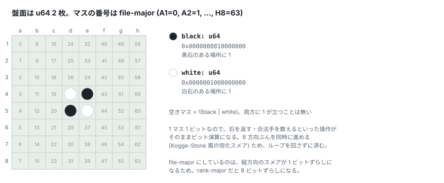
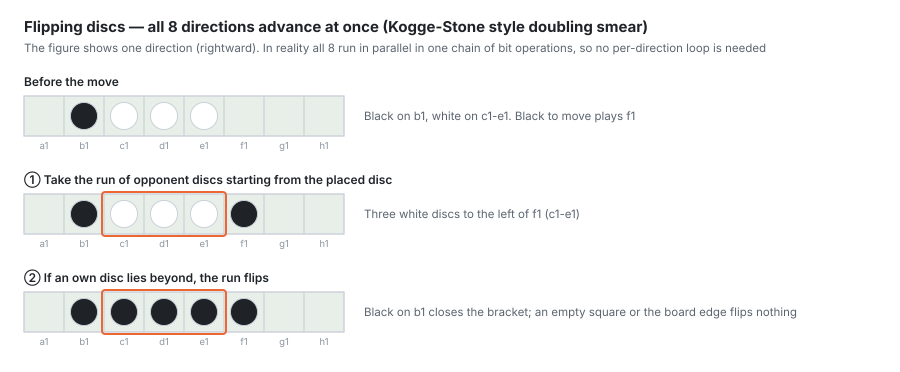

# Board representation and bit operations

How the board is held, and how flipping and legal move generation are
reduced to bit operations. The position hash and stable discs live here too.

## Board representation and bit operations



### Representation

```rust
pub struct Board { black: u64, white: u64, player: Color, empty_count: u8 }
```

One bitboard per colour (2×u64 in total). Empty squares are not held
but derived as `!(black | white)`. The struct is a 24-byte `Copy` type
containing no heap allocation at all, so copying a position during the
search is a single memcpy.

**The bit layout is file-major (`bit = file*8 + rank`)**. It is not
the usual rank-major, so the direction offsets are `±1` for vertical,
`±8` for horizontal and `±7/±9` for the diagonals. In return for this
choice one byte corresponds to one file, and **the left-right mirror
becomes a single `swap_bytes()` instruction**.

Fetching the side-to-move bitboard, `player_bb()`, is an array index
selection `[black, white][player.index()]` with no branch (`Color` is
`#[repr(u8)]` with `Black=0 / White=1`).

### Flip computation — a Kogge-Stone-style doubling smear



`bitboard::flip_shift<const DIR: u32, const UP: bool>` is the core.
Because the direction is **fixed at compile time by a const generic**,
all eight directions monomorphise into straight-line code with
immediate shift amounts.

The algorithm is the classic one of smearing one's own discs into a
run of opponent discs, but it prepares `opp2 = opp & shift(opp)`
(adjacent pairs of opponent discs) in advance to **advance two squares
per step**. The step sequence 1→1→2→2 covers reversi's maximum flip
length of 6, and **the dependency chain shortens from 6 to 4**
compared with six naive sequential shifts.

The anchor test (is the end of the run one's own disc?) is the
**branch-free** test `shift(f) & player != 0`, returning `f` when it
holds and `0` when it does not.

### Edge wrap-around — per-direction masks

Rather than masking at every step, **the opponent's bitboard is masked
just once**:

| Constant | Value | Purpose |
|---|---|---|
| `MASK_RANK` | `0x7E7E…7E` | ±1 directions (excludes rank 0/7) |
| `MASK_FILE` | `0x00FF…FF00` | ±8 directions (excludes file 0/7) |
| `MASK_DIAG` | `0x007E…7E00` | ±7/±9 directions (excludes both) |

The justification is that "the edge square along the scan direction
can never be part of a flipped run (its anchor would be off the
board)". This makes the shift scan wrap-free and **the masking inside
the loop disappears**. `flippable` computes the three masks once at
the top and reuses them for every direction.

### Legal move generation

`some_mobility` ORs `<<dir` and `>>dir` together so that one function
handles both signs, and expands the six-stage smear as **unrolled
straight-line code**. ORing the four axes and ANDing with the empty
squares yields the legal move bitboard, and **the mobility count is a
single popcount** (`mobility_count`).

### Applying a move — make/unmake

```rust
self.black ^= pos_bit | flipped;  self.white ^= flipped;
```

Placing the disc and flipping are completed with **two XORs**.
`undo_move` is a perfectly symmetric undo that merely re-applies the
same XOR pattern: **a make/unmake scheme that saves no copy of the
position**. `make_move_bits` calls `flippable` only once and uses the
result for both validation and application.

A pass only flips `player`.

### Symmetries

`transpose()` is an a1-h8 transpose via three delta-swap stages. The
index expression is symmetric, so **the same function serves in both
directions as a rank-major ⇄ file-major layout conversion** (used for
training-data I/O). `rotate_90() = transpose(swap_bytes())`,
`mirror_horizontal() = swap_bytes()`. `symmetries()` returns the eight
symmetric forms.

### Neighbour table

`NeighbourTable` precomputes the 8-neighbour masks for all 64 squares;
during the endgame enumeration of empties, `neighbours.get(sq) &
opponent_bb == 0` means "not adjacent to any opponent disc, hence
certainly illegal", and the branch is discarded before `flippable` is
called — an **early-rejection filter**.

---

---

## Hashing (Zobrist)

`ZobristTable` is generated by a fixed-seed 64bit LCG (reproducible).
`OnceLock` makes it initialised and shared exactly once across all
threads.

The trick is holding a **derived table
`flip_zobrist[sq] = set_zobrist[sq][Black] ^ set_zobrist[sq][White]`**.
Flipping a disc is the operation "remove one colour's key and insert
the other's", so XORing this single value is enough — **two XORs
become one, and there is no longer any need to know the colour before
the flip**.

The incremental update `update_hash_on_move` (1) XORs `flip_zobrist`
for each flipped square, (2) XORs the key of the placed square, and
(3) XORs the side-to-move key, giving **O(flips + 2)** with no full
board scan. A pass is a single XOR of the side-to-move key, and
because XOR is its own inverse, the identity of positions across
consecutive passes is preserved naturally.

---

---

## Stable discs (stability)

The search window is pruned from the number of discs that can never be
flipped again (stable discs). If the opponent has S stable discs, our
final score is at most `64 - 2S`.

- **Edge stable discs are exact**: for all `3^8` configurations of a
  one-dimensional 8-square line, the set that "cannot be flipped no
  matter how play goes" was computed by **greatest-fixed-point
  iteration** (`build_edge_table`) into a 64KB table. The four edges
  are read with gather/scatter
- **Full lines** (`full_lines`) are computed bit-parallel by a
  byte-wise AND reduction (four directions: horizontal, vertical and
  both diagonals)
- **Propagation loop**: in each of the four directions a disc
  sandwiched between "one's own disc or a wall" is accepted as stable;
  iterate until nothing changes

There was a pitfall in how this is used in the search. Originally it
was gated on the α value, but PVS null windows are placed near the
root value, so it never fired. The correct form is a **necessary
condition gate by popcount** — compute `need = (64 - alpha + 1) / 2`
and decide that if the opponent's total disc count falls short of it,
nothing can be pruned without even counting stable discs.

The β-side cut did not pay off on balanced positions (FFO40-45) and
was rejected once, but it turned out to be effective on lopsided ones
(FFO#59) and was reinstated. It is recorded as **a concrete case where
a biased measurement set led to the wrong accept/reject decision**.
