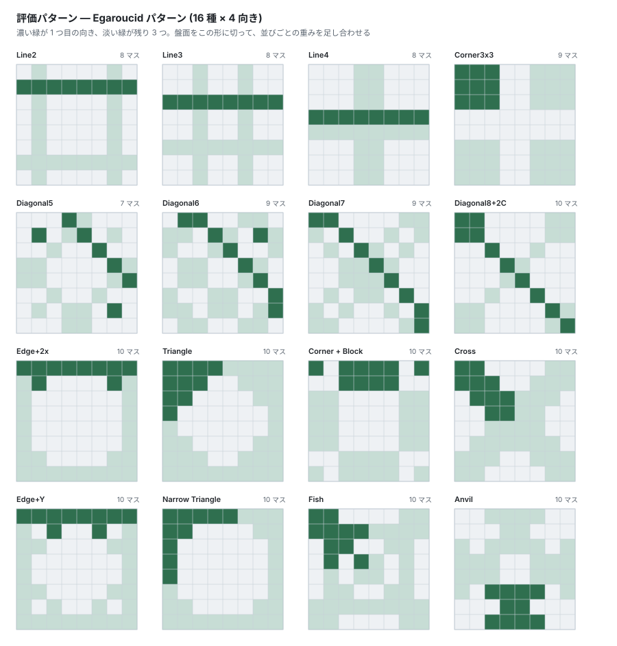

# Evaluation function

The part that turns a board into a number. A linear evaluation that looks up
groups of squares (patterns), and the NNUE that replaced it.

## Evaluation function



*The default **Egaroucid patterns** (16 kinds × 4 orientations). Dark green is the first orientation, pale green the other 3.*

### Pattern evaluation

A linear model: for every fixed shape (pattern) on the board, the disc
configuration of that shape is converted into a base-3 index, a weight table
is looked up, and the results are summed.

The index is base-3 with `0 = own, 1 = opponent, 2 = empty` (the leading
square is the most significant digit), and the table size is `3^size`.

Which squares form a group is taken directly from what the public engines
use. Implemented are 3 sets: the 2 families **Egaroucid patterns** and
**Edax patterns**, plus an experimental set that extends the former:

| Set | Patterns | Masks incl. orientations | Notes |
|---|---|---|---|
| `EGAROUCID_PATTERNS` (Egaroucid patterns) | 16 | 64 | Default. The strongest at present |
| `EDAX_PATTERNS` (Edax patterns) | 12 | 46 | — |
| `EGAROUCID_PLUS_PATTERNS` | 18 | 72 | Egaroucid patterns + `ANGLE_X` + `DIAGONAL4` |

`EGAROUCID_PLUS` is an experimental set that adds a shape small enough to be
learned completely even in the opening (`Diagonal4` = 81 cells), motivated by
the measurement that "statistical analysis of the trained weights shows the
opening-stage tables of the 10-cell patterns are visited less than 6% of the
time even with 25 million training positions". In league play, however, it
did not beat the default Egaroucid 16.

### Stage split and the disc-count feature

The weights are 3-dimensional, `weights[stage][pattern][index]`.
`STAGE_COUNT = 61`, and the stage is the number of moves played.

On top of that, **`num_weights[stage][player disc count]` (65 entries) is
added**. The total disc count is fixed within a stage, so this effectively
expresses the **disc difference** and supplies the global information that
local patterns alone cannot provide.

### Weight file format

Magic `BBRVWT02` (v2, with the disc-count table) / `BBRVWT01` (v1
compatible, still readable). Saving is an **atomic write** — temporary file +
`sync_all` + `rename` — so an interruption never corrupts the existing
weights. On load the stage count, the pattern count and each table size are
checked, so weights from a different library fail to load.

---

---

## Incremental pattern indices

The change that sped up the search the most (**midgame NPS +130-147%**).

The naive implementation of pattern evaluation recomputes the indices of
every mask on each evaluation. That dominated the search cost, so it was
replaced by a scheme that **updates the indices incrementally as moves are
played and taken back**.

The core trick is to **hold the indices in absolute colors (0 = black,
1 = white, 2 = empty)**. That makes them independent of the side to move, so
`apply` / `undo` do not have to care about it. Only when evaluating from
White's point of view is the index mapped through a precomputed **digit-swap
table** (`swap_tables[size]`, an involution that exchanges digits 0 and 1).

Implementation notes:

- The update entries are in **CSR form**
  (`entries[offsets[sq]..offsets[sq+1]]`), giving "the mask this square
  belongs to and the digit weight `3^k`"
- The update is a `wrapping_add` of `digit_diff.wrapping_mul(pow3)`. The
  difference is two's complement, but since the true result always fits in
  `0..3^size` the wrapping arithmetic is exactly correct
- The order of addition is kept identical to the recomputing
  `Evaluator::eval`, so the results are **bit-exact in f32**
  (`test_eval_indices_bit_exact_with_eval` verifies this)
- `PatternIndices` is a `Copy` type of `[u16; 80]`

Making the endgame solver's move-ordering evaluation incremental in the same
way achieved **-25% time on FFO40-49 (with node counts exactly identical)**.

---

---

## NNUE evaluation function

The linear pattern evaluation has a convex MSE loss, and its held-out MSE
plateaus at **~39 disc²** (it cannot express interactions between features).
Feeding the same incremental pattern features through a non-linear NNUE broke
that floor.

```text
active features (64 masks) ──▶ feature transformer (H dims/feature, shared by all stages)
                                    │ sum = accumulator (H)
                                    │ ReLU
                                    ▼
                        per-stage linear readout ──▶ evaluation (disc difference)
```

### Where it stands (v0002_valfull, 13.73 million positions)

| Evaluation function | val MSE | Speed (vs linear) |
|---|---|---|
| Linear evaluation | 39.09 | 1.00x |
| Egaroucid production | 38.95 | — |
| **NNUE (H=16)** | **36.15** | **0.98x** |

In pure-evaluation matches at the same search depth it beats the linear
evaluation significantly, **57.5% at depth4 / 64.7% at depth6**. **A large
improvement in MSE widens its edge the deeper the search goes** — the
opposite of a small difference, which vanishes by depth8.

### Speed: the 16.3x → 0.98x breakdown (MSE completely unchanged)

**The ratios in this table are both NPS ratios and time ratios.** The sweep
is full-width at fixed depth, so the linear and the NNUE versions visit the
same node set (6,248,308), and the two coincide by definition.

| Step | vs linear | val MSE | Why it worked |
|---|---|---|---|
| f32 scalar, incrementally maintained | 16.3x | 36.100 | — |
| int16 quantization + NEON | 2.64x | 36.148 | Half the FT memory, 2x the SIMD width |
| Interleaved viewpoints (2H updated at once) | 1.51x | 36.148 | Half the loads per mask |
| **Leaf reconstruction scheme** | **1.12x** | 36.148 | **Accumulation at internal nodes removed** |
| Separate FT per viewpoint | 1.05x | 36.148 | Half the load volume at leaves |
| **4-way partial sums + prefetch** | **0.98x** | **36.148** | Breaks the serial dependency of 64 rows |

Everything from int16 onwards is a **bit-identical transformation** (layout
changes and instruction-level parallelism), so **the MSE stays pinned at
36.148**. It is faster than the linear evaluation and has lost no accuracy.

**The single biggest step was to stop maintaining the accumulator
incrementally.** Maintaining it across make/unmake touches ~50 random cache
lines per move (2H wide × old/new × mask overlap). Restricting internal nodes
to the same 2-byte index update as the linear version and doing the H
accumulation only at leaves gives less total memory traffic.

Rejected: aggregating the deltas per mask to cut the FT accesses down to 1
is slower instead (1.83x). Against the cost of zero-initializing the
array, the flipped discs lie on a single line and the masks overlap little.

### Precision: i16 is the optimum (all 13.73 million val positions)

| Precision | val MSE | vs f32 | Speed | Verdict |
|---|---|---|---|---|
| f32 | 36.100 | — | 5.70x slower | ✗ Too slow |
| i32 | 36.103 | +0.004 | 5.41x slower | ✗ Too slow |
| **i16** | **36.148** | **+0.048** | **0.98x** | **✓ Adopted** |
| i8 | 36.632 | +0.532 | 0.90x | ✗ **Rejected: it costs accuracy** |

The quantization loss of i16 is 0.05 disc² (0.1%), negligible, while i32 and
f32 are 5x slower. At 2 bytes the FT fits in cache, and NEON gets 2x the
width with int16x8.

**i8 was rejected.** It is 8% faster but the MSE degrades by +0.48. The
policy is not to trade away evaluation accuracy, and even unused it left the
cost of building a 20MB table, so the code was deleted outright.

> **Pitfall**: the NEON readout (`vmlal_s16`) **accumulates into i32 lanes**.
> `acc(~16.4k) × w(32k) × H=16 ≈ 2e9` overflows i32 and **flips the sign of
> the evaluation** (measured: f32 +115 against i16 -104). The readout scale
> is capped at a value derived backwards from the i32 limit.
> `test_eval_paths_agree` verifies that the 3 paths — f32, incremental and
> leaf reconstruction — agree, and it caught this overflow.

### Choosing H (the accumulator width)

**Measured under the incrementally maintained scheme** (2026-07-27):

| H | val MSE | Speed | Verdict at the time |
|---|---|---|---|
| 64 | 33.83 | Slow | Strongest but heavy |
| **16** | **36.15** | **0.98x** | **Adopted** |
| 8 | 39.78 | 0.96x | Faster than linear but **weaker than linear**, so pointless |

H=8 cannot beat the linear evaluation, so its speed means nothing. At the
time H=16 was the optimum between strength and speed.

**Re-measuring on 2026-08-17 did not change the verdict.** Since the switch
to leaf reconstruction removed the accumulation at internal nodes, there was
reason to suspect that "the price of H is gone now" — it is not. Measured on
the production path, alternating with the linear baseline 3 times each:

| H | vs linear | Measured nps | val MSE |
|---|---|---|---:|
| **16** | **0.96-1.15x** | **9.5-11.0 Mnps** | **31.05** |
| 64 | 2.06-2.18x | 4.95-5.24 Mnps | 27.63 |

**4x the width is about 2x slower.** Widening does improve the
evaluation (MSE −3.4), but that edge is washed out by depth. Results of
head-to-head play (`gtp` + `roundrobin`):

| Condition | Games | H=64 win rate |
|---|---:|---|
| Fixed depth 8 | 200 | **60.8%** |
| **300 ms/move** | 400 | 52.6% (95% CI 47.7..57.5) |

**Looking only at fixed depth would have shipped the wrong thing.** Fixed
depth ignores speed, so it measures only the quality of the evaluation. Under
game conditions the difference disappears.

> **It was once written that "the price is 8%", but that was an invalid
> number measured on a defective build.** The NEON partial sums in
> `accumulate_rows` were fixed at `[int16x8_t; 2]`, so at H=64 only 16 of the
> 64 lanes were being added (since fixed). Of course it looks fast when the
> summation does 1/4 of the work. **Before measuring speed, make
> `cargo test` pass on that build** — `test_eval_paths_agree` catches this
> defect.

Incidentally, the 3 points from that same 2026-07-27 run (H=8 39.67 /
H=16 36.10 / H=64 33.63) show that **width acts monotonically on MSE**. The
later statement that "H=16 is better than H=64 (33.63)" was an error that
compared the old H=64 figure against a newer H=16 (31.05) trained on
**different data by a different procedure**. The conclusion (take H=16) is
nevertheless correct, on the speed side.

### Parallelizing the search (YBWC + Lazy SMP)

The NNUE midgame search is parallelized in two ways. **Shallow iterations use
Lazy SMP, deep iterations use YBWC.** Both share a single thread pool that
lives for the whole process.

Exact agreement with the sequential search used to be a requirement, but that
left helpers unable to contribute anything to the main thread and capped the
speedup at 1.10x. Non-determinism is now accepted as a property, and playing
strength is measured directly instead.

#### Strength is verified by head-to-head games between identical engines

Win rates against an external engine cannot detect it. Even at 200 games the
95% confidence interval is ±7%, and this measurement was repeatedly used to
conclude, wrongly, that "parallelization has not weakened play".
`lab --self-vs <threads>` plays self-play games **with the same net, the same
depth and the same endgame threshold, varying only the thread count**. At
equal depth it should be 50%; anything below that is a loss of strength.

Defects found with this measurement. Both show up as "fewer nodes", so
looking at time alone makes them look like speedups:

| Defect | Symptom |
|---|---|
| The transposition table ignored selectivity | The main thread adopted the helpers' over-aggressive pruning as-is |
| ABORTED propagated wrongly | A sibling's fail-high discarded the whole node, throwing away that fail-high itself |

Before the fix, 10 threads scored **38.8%** (95% CI 30.0..47.5), disc
difference -3.14 — significantly weaker. On the surface it was 2.57x faster.
After the fix, 48.5% / 1.11x.

#### Midgame parallelism is set by tree size for Egaroucid too

**The goal set at the outset, "Egaroucid's 3.28x on 6 threads", was the wrong
goal for the midgame.** That figure was measured with `--edax-threads` as a
per-move average over whole games, and Egaroucid at L15 enters the exact
solve from 22 empties. **Most of the 3x-plus is the parallelism of the
endgame solver.**

How to isolate and measure **Egaroucid's midgame alone**: with `-noise` it
prints `main mid depth ... n_nodes ... time ...`. Choosing positions where
empties > depth keeps the main search in the midgame (at 30 empties with L21
it enters the exact solve). Positions advance by repeating `go` after
`setboard`, so play N moves at a low level and read the board off.

A 42-empty position, minimum of 5 rounds:

| Egaroucid level | Tree (1 thread) | t=6 | t=8 |
|---|---|---|---|
| 15 | 126k | 2.80x | 2.33x |
| 17 | 278k | 1.93x | 1.93x |
| 19 | 571k | 2.48x | 2.70x |
| 21 | 1.77M | 2.57x | 4.02x |
| 23 | 4.09M | 3.55x | 5.09x |
| 25 | 13.1M | 3.31x | 4.51x |

**Egaroucid's midgame parallelism also depends strongly on tree size.** And
once the tree sizes are matched we are roughly on par: our d20 is 780
thousand nodes per move at **2.34x**, and Egaroucid's comparably sized L19
(570 thousand) is **2.48x** — a 6% difference. The nodes per move are close
too (170 thousand for our d16, 140 thousand for Egaroucid L15), as is
single-thread nps (8.2 against 10.1 Mnps).

#### The 3x shows up in phases where the tree is big

Isolating the endgame solver (a separate implementation,
`Solver::set_threads`) and measuring it over 10 games, minimum of 2 rounds:

| Endgame threshold | Phase | T=1 | T=6 | T=8 |
|---|---|---|---|---|
| 22 empties | Endgame | 9.1s | 3.8s (2.39x) | 3.4s (2.68x) |
| 24 empties | Endgame | 26.0s | 11.9s (2.18x) | **8.6s (3.02x)** |
| 24 empties | Total | 28.7s | 13.8s (2.08x) | **10.5s (2.73x)** |

At the practical setting of d18 + a 24-empty exact solve, 6 threads give
1.98x in the midgame / 2.33x in the endgame / **2.20x overall**. **The 3x
does appear in phases whose trees run to tens of millions of nodes, so the
reason it does not appear in the midgame is tree size, not the
implementation** — Egaroucid is under the same constraint.

#### Measure the reachable parallelism first

Looking only at our own speed ratio does not tell whether it is the limit of
the implementation or of the hardware. `lab --edax-threads <n>` **keeps us
pinned to 1 thread and varies only the opponent's thread count**, so it
yields Egaroucid's parallel efficiency directly, on the same machine (10
physical cores, minimum of 3 rounds):

| Egaroucid threads | 1 | 2 | 4 | 6 | 8 | 10 |
|---|---|---|---|---|---|---|
| Speed ratio | 1.00x | 1.47x | 2.43x | **3.28x** | **4.00x** | 3.74x |

3x is achievable on this machine. Everything short of that may be treated as
an implementation difference.

#### How YBWC is built

- What gets split are **children whose window is a null window** (i.e. not
  the eldest child). Judging by the parent's window puts the whole PV line
  out of scope, throwing away the top of the tree — the largest subtree.
  Fixing it raised worker utilization from 32% to 41%
- When a task fails high, cut the siblings off immediately. But **only when
  the parent is a null-window node**. A fail-high at a PV node merely demands
  a re-search with the full window; the siblings still matter
- **Carry the abort flags of every ancestor.** Passing only the node's own
  flag means that when an ancestor aborts, grandchild tasks search a tree
  nobody will read all the way to the end, while the parent `wait`s for them.
  This alone dropped the extra nodes under parallelism **from 1.42x the
  sequential count to 1.04x**
- But **allocate the flag only at nodes that can be split**. A `bool` on the
  stack is free, but this one is heap-allocated, so creating it at every
  internal node costs 13% of single-thread performance for a flag nobody can
  raise. **The fan-out cutoff itself is done with a local bool** — making it
  depend on the flag means that at nodes without one (i.e. during sequential
  execution) a fail-high stops nothing and the node count quadruples
- Workers split recursively as well. A thread waiting on a split runs tasks
  from the queue while it waits, so no task is ever stuck "behind the thread
  that needs it"
- **Decide whether a split is possible without a lock, before taking one.**
  Split attempts happen hundreds of thousands of times a second and most are
  refused, so taking a mutex just to learn of the refusal serializes every
  search thread onto a single lock
- Polling for a split checks the queue length atomically before taking the
  lock at all. Locking on every emptiness check lets the waiting side
  serialize all the workers

#### Move ordering: "always score" + weights that vary by node type

The **shape** matters more than the numbers.

1. **Always score every move.** The transposition-table move merely comes
   first thanks to a large constant bonus; the ordering itself is not
   skipped. We used to skip the ordering entirely when there was a
   transposition-table move and leave the rest in bit order. Those are
   **exactly the younger siblings YBWC splits**, and when a badly ordered
   sibling exceeds alpha the fan-out stops and everything behind it is
   re-searched
2. **The weights differ by node type.** At PV nodes the evaluation
   dominates; at null-window nodes the evaluation barely matters and the
   mobility count dominates. **Most of the tree is null-window nodes, so most
   of the tree is ordered by mobility**
3. Mobility is weighted (moves x2 + corner moves +1), and at PV nodes
   potential mobility (empties adjacent to the opponent's discs) is added on
   top

Point 2 matters especially for us, where evaluation is expensive. The NNUE
evaluation is orders of magnitude heavier than the incremental pattern
evaluation, so using it to order every null-window node pours the budget into
the worst possible place.

d16 / 20 games / minimum of 3 rounds: **26.8s -> 21.3s (-21%) on 1 thread,
nodes 172M -> 111M (-35%)**. Strength is unchanged (49.0% -> 48.5% over 100
games against Egaroucid L15; both have wide 95% CIs and show no difference).

#### Shallow null-window nodes get a dedicated routine and never touch the transposition table

NWS is split into separate implementations by depth:

- Depth 1: **no transposition table, no list, no ordering**. Legal moves are
  scanned in a fixed priority order by square type (corner -> box -> block ->
  X/C) and it returns the moment alpha is exceeded
- Depth 2: the transposition table is probed, but its move is searched first
  and the rest ordered afterwards
- Depth 3-4: simplified ordering, with neither YBWC nor ETC

Specializing depth 1 alone **raised nps from 4.33 to 6.05 Mnps (+40%)**. The
node count is essentially the same, so that is entirely the 2 read/write
trips into a 400 MB table. Depth-1 null-window nodes are the most numerous in
the tree, and **they sit below the depth at which splitting is possible**, so
this cost was coming entirely out of the sequential part.

> The union of the 4 fixed-priority masks does not include the 4 central
> squares, but those are filled from the initial position and can
> never be legal moves, so coverage is not a problem.

#### The transposition-table move is searched on its own, before the ordering

The transposition-table move is searched first, and if it produces a cutoff
**the scoring pass never runs at all**. Our scoring pass runs 1 NNUE
evaluation per child, so among the things that can be skipped at cutoff nodes
(about half of an alpha-beta tree) this is the most expensive. Node counts
stay exactly identical while **nps is +5%**.

#### The transposition table holds 2 bounds, lower/upper, not 1 value

1 value plus a "lower/upper/exact" tag can answer only half of what is
asked. A node that failed low leaves only an upper bound, so a search
arriving later with a window that needs a lower bound learns nothing and
searches again. Both ends are accumulated into the same entry on every visit,
and the side the caller can use is handed back. On a hit the window itself is
narrowed from both sides.

**This implementation failed twice before it landed.** 3 things were
missing:

1. **The bound-repair clause.** When lowering the upper bound, if the lower
   bound exceeds it, lower the lower bound too (and vice versa). ProbCut is
   probabilistic, so searching the same node with a different window really
   does produce `lower > upper`
2. The bonuses for the transposition-table move and the second-best move must
   be **added to the score before sorting**. Doing `swap(0, i)` twice does not
   put the second-best move second, and it kicks out the head that the
   ordering chose (this alone changed node counts by 32%)
3. Having the second-best move at all

d16 / 20 games / minimum of 3 rounds: **21.8s -> 18.4s (-16%) on 1 thread,
nodes 111M -> 90M (-19%)**. Strength: 46.0% -> 47.0% over 200 games against
Egaroucid L15, and 54.6% on 6 threads over 120 self-play games (disc
difference +0.12).

#### The transposition table replaces 3-way, depth-first

3 consecutive slots are scanned, and **only slots worth less than the
result being stored** are overwritten (worth is judged depth-first). If all 3
are deeper, nothing is written.

A 1-way direct-mapped table cannot express this. Shallow stores near the
leaves evict, every time, the deep entries the iteration above them needs.
**-34% nodes and -24% wall-clock on a single thread.** It helps even more
under parallelism — shallow stores arrive from every worker at once, so deep
entries barely survive.

#### Loosening the "hand off only when idle" rule is faster

The rule "hand work to a worker only when it is idle **right now**"
(`n_idle > 0`) is faster once loosened. With 9 younger siblings and 5 idle
threads, the parent hands off 5 and then **searches the remaining 4 itself,
in sequence** (they are refused because nothing is idle). Meanwhile the 5 it
handed off (45 µs each) finish, and the workers starve for the rest of the
fan-out.

Allow the queue to hold up to the idle count + `POOL_SLACK`. At d16 / 20
games / minimum of 3 rounds: 0 -> 2.25x, 2 -> 2.41x, **8 -> 2.47x**,
32 -> 2.18x, 128 -> 2.20x. Beyond 8 the price of duplicated search outweighs
the gain in occupancy (nodes go from 175M to 252M).

This is **the revival of a measure that was once rejected**. Allowing a queue
used to inflate the nodes to 1.87x the sequential count and lose. The
`searchings` chain removed the node inflation down to 1.03x, so the premise
changed. The revival could be judged only because the reason for the
rejection had been recorded too.

If work is queued, **check for the abort the moment it is dequeued**.
`ABORT_CHECK_INTERVAL` is 512 nodes, so even if a sibling failed high while
the task was waiting, the task only notices after searching 512 nodes. A
single check at dequeue took the same setting from 12.0s to 11.2s.

#### Measurements

The ceiling is **5.7x of aggregate throughput from 6 independent
processes** (no sharing, no synchronization; 94% per core). It is not
memory-bandwidth bound.

d16 / 20 games / against Egaroucid L15, minimum of 3 rounds (midgame time):

| Version | 1 thread | 6 threads | Speed ratio | Nodes at 1 thread |
|---|---|---|---|---|
| Before the fixes | 39.6s | 24.0s | 1.65x | 261M |
| `searchings` chain + 3-way transposition table + lock-free split test | 30.2s | 12.1s | 2.50x | 172M |
| + not touching `Arc` at non-split nodes | 27.3s | 13.0s | 2.10x | 172M |
| + queue slack + abort check at dequeue | 26.8s | 11.5s | **2.46x** (8 threads) | 172M |
| + the ordering port | 21.3s | 10.9s | 1.95x | 111M |
| + lower/upper bounds + second-best move | 18.4s | 9.3s | 1.98x | 90M |
| + queue slack from 8 to 2 (re-measured) | 18.0s | 9.0s | 2.00x | 90M |
| + dedicated depth-1 NWS | 12.4s | 7.9s | 1.57x | 94M |
| + searching the transposition-table move first | **11.5s** | **7.2s** | 1.60x | **94M** |

Cumulatively from the start of the session (39.6s on 1 thread / 24.0s on 6)
that is **3.44x on 1 thread and 3.33x on 6 threads**. The speed ratio is
roughly flat, from 1.65x to 1.60x, but that is because the denominator got
3.4x faster — **in wall-clock terms 6 threads improved by 3.3x**.

The last row is an example of **the speed ratio falling while wall-clock
shrinks**. The denominator got 21% faster so the ratio drops, but the
6-thread wall-clock matches the best 8-thread figure. Node inflation under
parallelism rose from 1.02x to 1.26x — better ordering means more nodes cut
off after 1 child, fewer younger siblings available to split, and therefore
more speculative splitting. **Targeting the ratio would make us reject a
wall-clock improvement**, so both are recorded side by side.

**3x has not been reached.** On the same machine Egaroucid gets 3.28x on 6
threads. The way threads are counted (pool size + main thread) has been
confirmed to be the same, so this is an implementation difference, not a
counting difference.

Strength has not dropped (60 self-play games, d16): 6 threads **53.3%**
(29W 25L 6D, disc difference +0.93), 8 threads 54.2% (31W 26L 3D, disc
difference +0.53). Both 95% confidence intervals include 50%.

**Parallelism is set by tree size** (10 games, midgame time only):

| Depth | 1 thread | 6 threads | Speed ratio | Worker utilization |
|---|---|---|---|---|
| 12 | 3.3s | 1.9s | 1.74x | 38% |
| 16 | 15.0s | 9.1s | 1.65x | 50% |
| 20 | 68.2s | 28.3s | **2.41x** | **64%** |

At 320 thousand nodes per move (d16) we are an order of magnitude below
Egaroucid, and nodes at depth 6 or more — the split points themselves — are
simply too few. Raising the depth improves things straightforwardly, but **a
speed ratio at a depth never used in games must not be counted as a result**.
For the minimum split depth (`YBWC_MIN`), 4 and 6 are equivalent and 3 is
worse (3 -> 1.87x, 4 -> 2.26x, 6 -> 2.27x).

#### The residual is all idleness, and per-core efficiency has not dropped

At d16 / 6 threads, effective CPU time = (midgame time - main-thread
starvation) + (worker busy time - worker starvation) = 27.2 core seconds.
That almost matches the sequential midgame time of 27.8s, and nps per core is
6.49 against 6.18 Mnps — **not below the sequential figure**. Against the 78
core seconds available, 27.2 is 35% utilization. **The utilization needed for
3x is not 100% but 49%.**

> It was recorded at one point that "the nps of a working core is 66% of
> sequential", but that number came from the version doing an atomic RMW on a
> shared refcount at every internal node, and it disappeared the moment that
> was fixed. It is consistent with this that every measure aimed at per-core
> efficiency (cache-line-aligned 4-way buckets, spinning before workers park,
> removing the condition-variable timeout) turned out to be noise. **3x will
> not come from shared costs; it will come from killing the idleness.**

#### The idleness is bimodal — look at it with `POOL_SAMPLE=1`

The average utilization alone cannot distinguish "always half" from
"alternating between full and empty", and the two call for opposite remedies.
`POOL_SAMPLE=1` samples the number of busy workers every 100 µs. Sample
**only during the midgame search** — including the opponent's turn and the
endgame solver leaves 3/4 of the samples empty and useless.

Distribution at d16 / 6 threads (5 workers):

| Busy workers | 0 | 1 | 2 | 3 | 4 | 5 |
|---|---|---|---|---|---|---|
| Before the ordering and bounds port | **29%** | 12% | 10% | 9% | 9% | **31%** |
| After the port | 18% | 14% | 14% | 12% | 14% | 28% |

Before the port the average was 2.50 workers + 0.63 main thread = 3.13
threads, which explains the 2.47x ratio. After the port the average rose to
2.74 and the time at 0 fell from 29% to 18%. The reason the ratio still
does not improve is that node inflation under parallelism rose from 1.02x to
1.36x (better ordering means more nodes cut off after 1 child, fewer
younger siblings available to split, and therefore more speculative
splitting). **Making the sequential search faster lowers the parallel ratio.**

The main thread starves waiting 37% of the time, and while it does at least
1 worker is running (there is someone to wait for). Therefore **the 29% at 0
workers is time the main thread spends on work that cannot be split**:
subtrees below depth 6, the reduced searches of MPC, and the serial stretch
walking down the eldest children. Filling that in would bring the average to
3.4 workers, which is 3x territory.

Trying to fill it by lowering the minimum split depth does not get there.
Even combined with a pre-park spin that hides the 9 µs handoff latency, the
lower it goes the worse it gets (minimum of 3 rounds, slack=8, 6 threads):

| `YBWC_MIN` | 6 | 5 | 4 | 3 |
|---|---|---|---|---|
| Without spin | **11.7s** | 12.2s | 12.4s | 18.0s |
| With spin | 11.9s | 11.8s | 11.8s | 17.8s |

Spinning helps only when the minimum is lowered (the latency grows relative
to the task length), but it cannot cover the loss of lowering it at all. **A
minimum of 6 is optimal.**

> Rejected parallelizations: **root splitting** lost to a single thread (1.3x
> slower for 1.7x the nodes). **A dedicated transposition table per worker**
> raises nps by 19% but increases nodes by 69%, and losing the main thread's
> ordering information makes wall-clock 42% worse.
> **16-20 threads** is consistently slower in an environment with 10 physical
> cores. **Always ordering the children at split-candidate nodes** cuts nodes
> by 3% but costs 10% of nps in evaluation, and loses in wall-clock.
> **Fitting a bucket into 1 cache line** (16B x 4-way, 64B aligned) and
> **spinning before workers park** are both noise (they merely scatter over
> the 11.4-13.5s range). Both are measures aimed at per-core efficiency, so
> the reason they do nothing is as above.
> **Dropping Lazy SMP for YBWC in the shallow iterations too** is worse as
> well (`SMP_MAX_DEPTH` 10 -> 2.37x, 4 -> 2.20x, 0 -> 2.20x). The gate
> limiting it to shallow iterations is right.
> **A serial path for nodes that will not be split** (picking the second-best
> move 1 at a time) loses at +4% nodes and roughly the same nps.
> The bookkeeping of the fan-out (the settled array, the Vec, the abort
> flags) cost nothing to begin with.
> This experiment did find 1 bug, though: the PVS re-search window is
> `nega_scout(-beta, -g)`, i.e. **the null-window result `g` becomes the new
> alpha**. Using the old alpha costs +17% nodes.
> **Not killing the running tasks on a fail-high** (not raising
> `n_searching`) is worse (7.6s / 1.54 inflation against 7.0s / 1.34). It
> pays to stop searches on the old window even at the cost of discarding work
> in progress.
> **ETC** (`etc_nws`) does nothing whatever the threshold (nodes ±0.5%). For
> us the transposition table's window narrowing and "searching the
> transposition-table move first" already play the same role.
> **Counting threads blocked in `Pool::wait` as `idle`** does nothing either.
> Splits rise from 1.10M to 1.28M but the time is unchanged: it is not that
> there is nowhere to hand work to, it is that there is no work to hand off
> at that moment.
> **Copying a task's indices from the parent's accumulator** (dropping the
> rebuild) is neutral (6.9s against 7.2s, within noise). `Nnue::indices`
> scans 80 masks, so the amount of work certainly goes down, but it does not
> show up in wall-clock.

### Training

`nnue_train` trains with Hogwild parallel SGD (2.2M pos/s on 10 threads). The
whole corpus (44 GB, 1.72 billion positions) does not fit in RAM, so it uses
the same **sharded loading** as the linear version. It reads files together
up to a budget (`--max-examples`, 48 million by default), trains, and
discards them. The file order is shuffled every epoch, so the combination of
shards never becomes a fixed correlation. `--init` continues from an existing
model.

**The trend that data volume dominates** continued unchanged:

| Training positions | val MSE |
|---|---|
| 24 million | 40.7 (overfitting) |
| 100 million | 36.1 |
| **1.72 billion** | **33.0** |

For comparison, Egaroucid's production eval is 38.95 and the linear
evaluation 39.55 (both measured by us on the same val set). However,
**improvements in MSE hardly convert into playing strength**: the 36.07 model
and the 33.02 model played 400 games at equal search for 52.5% (95% CI
47.6..57.4), disc difference +0.80. There is no significant difference.

**lr is around 0.0005.** The default of 0.02 is orders of magnitude too
large; from a warm start or from scratch alike, val diverges into the 600s.
`--val` measures held-out MSE every epoch and saves only the epochs that
improved, so even a divergence does not destroy the existing model.
