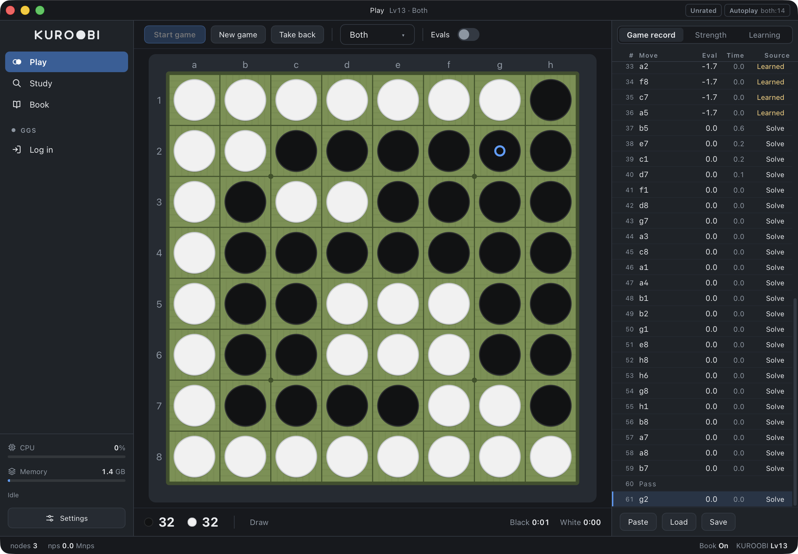
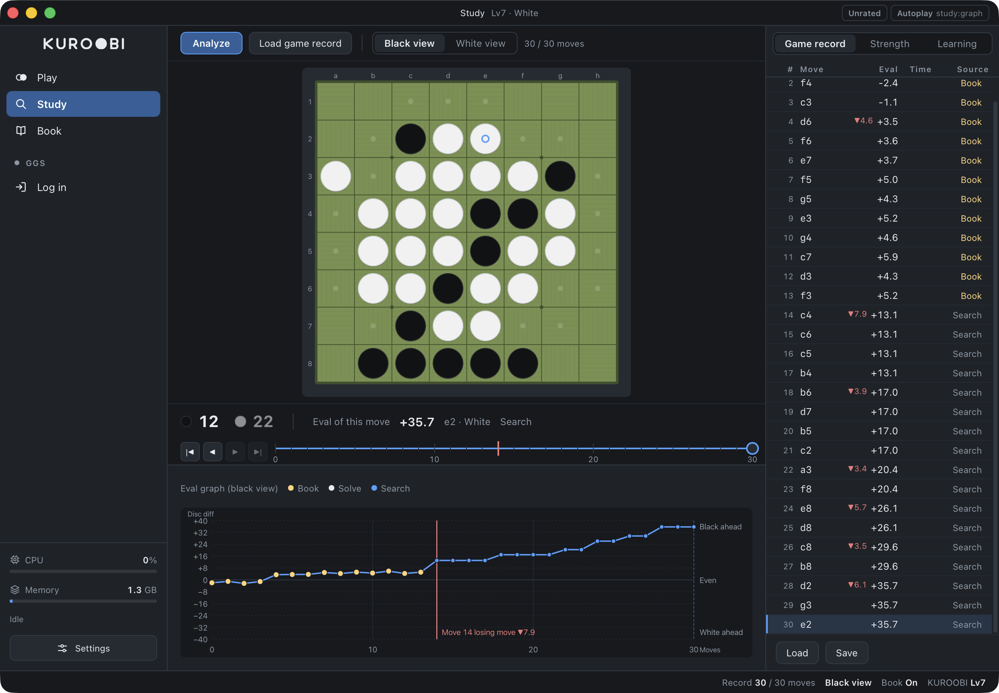
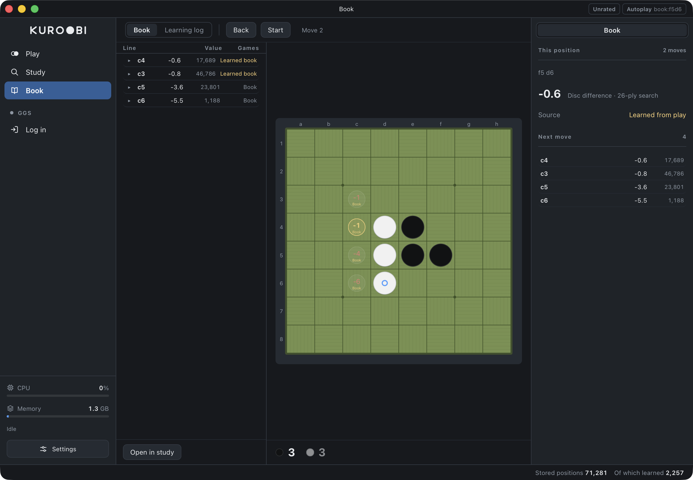
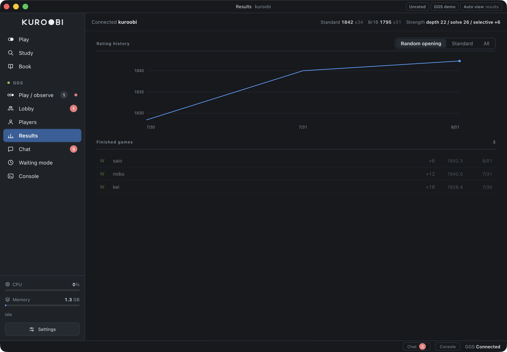

# GUI

The screens for play, study, the book and the GGS connection.

## Screens

The rail on the left is where you go: **Play, Study and Book**, plus the
seven screens that open once you connect to GGS (Play / observe, Lobby,
Players, Results, Chat, Waiting mode, Console). As the window narrows,
the right-hand panel folds first, then the labels on the left, then the
auxiliary information along the top; the board is the last thing left.

*Play. Controls above the board, disc counts and clocks below. The game
record on the right carries the evaluation, thinking time and source of
every move, and poor moves get a ▼ with how much they lost. The numbers
are in the strip at the bottom.*

*Study. Below the board is the strip that walks the moves (the losing
move carries a red mark), and below that the evaluation graph measured
across the game record. Turn on Evals in the toolbar and the squares of
the board show the evaluation of every legal move as well.*

*Book. Candidate moves appear both on the board and in the indented
list. The Source column separates moves from the book file from moves
learned in real games.*

*GGS. Finished games stay, together with how the rating moved (the
opponent in the picture is a made-up name).*

`gui/` is the desktop app for playing and studying. The screen is web
technology (Vite + TypeScript), the thinking is the Rust side (Tauri)
calling the library directly, and IPC connects the two. The engine is
not split off into a separate process, so even a search in progress can
report back to the screen as it goes.

- **Play** — who plays each turn (human / engine) can be switched.
- **Study** — scores every legal move under identical conditions and
  graphs how the evaluation moves. The strip below the board walks the
  moves (a tick per move, a scale mark every 10, a mark for the losing
  move).
- **Book** — walks the book from a position. The values of the candidate
  moves go on the board and the list of branches goes on the right as an
  indented tree, where the **Source column** separates moves from the
  original book file from moves written back by learning from real
  games. The number of games each was played in comes with it. You can
  go back and forth with Study.
- **Game record** — loads from both a paste and a file, and clicking a
  move goes back to that turn. The source of each move (book / search)
  is shown too. It reads **GGF** (Generic Game Format), which GGS uses,
  so a game that does not start from the initial position (a drawn
  opening) can be reproduced along with its starting position. Both a
  paste and a `.ggf` file work. A plain move list (`f5d6c3…`) and the
  form of one board line plus a move list are accepted as well. Before
  loading, the result of a preliminary read (the number of moves and the
  final diagram) is shown. **Export supports GGF too**, and the
  extension decides the format (the default is `.ggf`). The move-list
  form drops the colours, the result and the starting position, so GGF
  is the better choice for handing a game to other software.
- **GGS (online play)** — a client for GGS (Generic Game Server) is
  built in: play, observing, lobby, player information, results, chat,
  waiting mode (game over → interval wait → automatic match request,
  repeated) and a console for raw commands. The board, the clocks and
  the players' row are drawn with the same parts as a local game.
  Finished games stay in the archive, and pressing one opens its record
  in Study. See [What GGS taught us](#what-ggs-taught-us) for details.

The keys are ⌘N (new game), ⌘Z (take back), ⌘S (save), ⌘O (load), ⌘B
(book). In Study, ← → move one move, with ⇧ ten moves, and with ⌘ to the
first or last position.

The thinking settings (depth, exact solve, selective search, thread
count) are given by picking a level or with Custom. Whether the book is
used can be toggled too (used by default); turn it off when research
calls for the engine's own move.

The files the engine uses (linear evaluation weights, NNUE, book) can be
re-pointed from the gear. If nothing is given, `weights/` is found by
walking up. The settings are kept in the OS config directory. How the
board looks (theme, orientation, coordinates, the weave of the tatami,
the speed of the disc flip) is in the same settings.

### Learning the book from real games (not repeating the same loss)

In back-to-back games against the same opponent, two deterministic
engines easily repeat the same game record. Inside the book the choice
is spread by a randomised pick with a tolerance (a draw among the moves
within 1 disc of the best, weighted by how often each was played), but
that alone does not prevent a lost line from being played out again —
without a book the choice is completely deterministic, and the same loss
is repeated exactly.

So our own GGS games are imported into the book **win or lose**
(`learn.rs`). Each position the game passed through is given the move
actually played and an evaluation of the best of the other legal moves
(the alternative), and the final disc difference (for a resigned game,
the search value at the end) is written back to the root with negamax.

- Since each position's value is the best of its candidates, the value
  of a loss only travels back through the stretch where the alternative
  was bad too, and **localises where a good alternative remains — at the
  losing move**. Even opening moves are never avoided as collateral, and
  following the same line, the randomised pick naturally veers to the
  alternative at the losing move
- Won games are imported too, so that a line which was only won because
  the opponent erred, where the alternative was better, is not kept
  believed good
- There is no special logic for avoidance. "Not repeating the same loss"
  is a property of the negamax values, not a mechanism that forbids
  moves

The import is a job that advances one search at a time and runs a little
at a time between games (so thinking and server responses are never kept
waiting for minutes). What is learned is saved in a file separate from
the book itself (`book_learn.txt`) and overlaid at startup, so it does
not clash while `bookgen` is updating the main file, and even where
there is no book file a "book of experience" grows from the positions
real games went through.

Not only on GGS: a game finished in the local play mode is imported by
the same mechanism (run in the background; a game record that was merely
loaded, and a game that does not start from the initial position, are
out of scope). Whether to import is toggled by the play panel's Learning
tab and by the GGS engine settings (imported by default).

Imported games stay in that same Learning tab as a list, and can be
followed all the way to **game → losing move → the move that was
rewritten (old→new)**. Write-back overwrites values, so a single odd
game mixed in changes the moves that follow — the details are kept so it
can be found, and **an import can be undone per game**. Undoing restores
the value of a move that was in the book already, and removes, candidate
and all, a move that was not.

The build steps and the pitfalls are in [CLAUDE.md](CLAUDE.md).

---

## What GGS taught us

Things that only surfaced once we ran on the real server, and the
policies decided by reading the server implementation
(`GGS/Service/GameLib`).

### An adjourned game is not resumed automatically

If the opponent leaves during a game, GGS stores it as **adjourned**
(`Match.C::cb_adjourn`). The clocks stop at that point and there is no
deadline (`GAME_Stored.H` has no notion of expiry). If the side that is
losing leaves, analyses and then resumes, **the server does not hold it
against them**.

Resuming automatically from our side would hand the opponent a way to
think for as long as they like and then come back, so **resuming is
manual only**. Adjourned games stay in a list, and one can be picked and
resumed after refreshing Adjourned games.

### Lost time cannot be told from how much time is left

GGS has only one clock. When the main time runs out, the server adds the
extension **to that same clock** and sends it (`now += ext` in
`GAME_Clock.C::update`). Overrunning by 30 seconds from 50 seconds left
simply delivers a healthy-looking `01:30`; the screen cannot tell the
difference.

And **entering it already decides the loss**. `Game::blacks_result` caps
the result of whichever side flagged first at `min(the board, a
minimum-margin loss)`, so being ahead on the board still does not make
it a win. The extension is time for avoiding a shutout (a 64-disc loss)
and nothing else; running that out too makes it a maximum-margin loss.

So the engine decides it is in lost time from "the clock went up", and
once in it plays out without searching deep. While the threshold was
"half the extension", it **missed the case of overrunning with plenty of
time left** (from 50 seconds left to 1:30 the increase is only 40
seconds). Now any increase beyond the increment setting counts as having
entered it.

### Game records are re-fetched from the archive

For our own games only one board arrives (only an observer's join hands
over two, the start and the current one). There was a period where the
starting position of a drawn opening went unrecorded, and records from
then are stored as "the initial layout plus moves from partway through"
and **cannot be replayed**.

The server's archive (`tell /os look <number>`) keeps the correct game
record, down to **both sides' evaluations and time spent**. A game that
has a number is now opened from there. A synchro match packs two boards
into one number, so an overlay switches between them.

### There are only two rating pools

Formats split into `s8r16` / `s8r14` / `8r16` and so on, but ratings
split only two ways: standard (`8`) and random opening (`8r`) (the Type
table in finger has two rows too). The Results screen filters by pool.
**There is no rating that runs across pools**, so All draws no history
line.

### The list shows who is accepting

`who` prints a mark after the name (`VAR_Client::print_who`). `+` means
they can accept (`open > number of games in progress`), `-` means they
will not, `x` is a ghost (the remains of a dropped connection). **Some
people will not accept even while idle**, so a match request comes up
empty if this cannot be read. Since people do accept while playing too,
it is a column of its own, separate from the status.

### Chat survives a crash

Each login appends to `ggs_games/chat/<name>.jsonl`, and the most recent
300 entries are restored at startup. 5000 are kept; on overflow the file
is rewritten and packed down. An unreadable line (such as a last line
cut short by a crash mid-write) is discarded and the rest is used.
