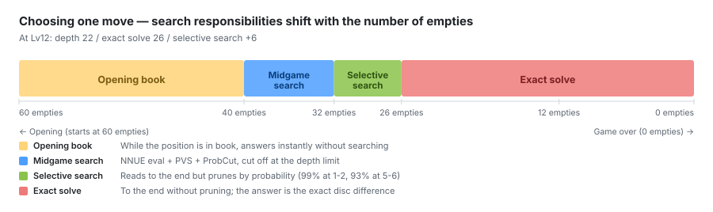

# 探索

中盤の選択的探索、終盤の完全読み、両者が共有する置換表。

## 中盤探索



`src/search.rs`。パターン評価上の反復深化 αβ (negamax)。

### 基本構成

- **PVS (Principal Variation Search)**: 第 1 子は全窓、以降は null-window で
  確認し、改善したときだけ全窓で再探索
- **反復深化** + 置換表による前段の最善手継承
- **ETC (Enhanced Transposition Cutoff)**: 残り深さ 4 以上で、全子局面の
  ハッシュを先に引き、fail-high が証明済みならこのノードを無探索で打ち切る
- **killer / history ヒューリスティック**、深いノードは全子の評価値で並べ替え
  (`EVAL_ORDER_MIN_DEPTH = 6`)、浅いノードは相手モビリティ・角/X 位置バイアス
- **葉の 0.5 石量子化**: f32 の連続値では「わずかに良い子」が頻発して
  PVS の null-window 確認がほぼ毎回フル再探索に化ける。半石は評価関数の
  ノイズ下限より十分細かいので棋力を損なわずに探索効率だけ改善する
- **葉の高速パス**: 深さ 0 では置換表を引かない (ほぼ確実にミスするうえ
  節約できるのは評価計算だけ)。パスも深さ 0 で inline 処理するため、
  深さ 1 のノードは子のハッシュ計算自体を省略できる

**aspiration window は採用していない**。PVS の null-window エントリと共有
置換表の上で干渉し、根の値の厳密性が壊れることをバイセクトで特定した
(参照 negamax との一致テストが失敗した)。

### ProbCut (MPC) — 最大の探索効率化

浅い探索の結果から深い探索の結果を統計的に予測し、窓を確信度マージン付きで
超えたら深い探索を省略する選択的枝刈り。null-window ノード限定 (PV 上では
行わない)。

較正は実測ベース。検証用棋譜から 3000 局面を抽出し、**局面ごとに置換表を
クリアした独立探索**を深さ 0/2/4/6/8/10 で回して誤差分布を採り、
2 次モデル `σ(空きマス, 深度, 縮小深度)` をフィットした
(較正ツール `mpccalib` + フィットスクリプト)。

- 縮小深度は `2*(d/4) + (d&1)` — 約 1/4 だが**パリティを保つ**
  (テンポのパリティが評価誤差に強く効くため)
- 静的評価で先にゲートしてから縮小探索を撃つ 2 段構え
- 再帰は 2 段まで。**probcut の結果は置換表に書かない** (未証明のバウンドが
  深度タグ付きの確定値に偽装するのを防ぐ)
- 既定は OFF。`Searcher::mpc` / `mpc_t` で有効化 (厳密性テストは OFF 前提)

効果 (FFO40-52 中盤モード):

| 深度 | MPC なし | MPC あり | 削減 |
|---|---|---|---|
| 10 | 3.42M ノード | 257k | **-92%** |
| 12 | 18.4M ノード | 597k | **-97%** |

**同深度での棋力劣化がないこと**を 800 局 × 2 で確認済み (47.7% / 47.1%、
いずれも有意差なし)。そのうえで **MPC depth12 は非 MPC depth10 に 55.3% で
有意に勝ち越す** (ノードは 1/5.7)。深度を上げるほど削減率が伸びるため、
実用時間内での深度引き上げが可能になった。

---

---

## 終盤完全読み (solver)

`src/solver.rs`。空きマス数を深さの代理指標として、残り空きマスに応じた
戦略の段階切り替えを行う。

| 空きマス | 戦略 |
|---|---|
| 7 以上 | PVS + 置換表 + ETC + 評価関数による並べ替え |
| 5〜6 | 素の αβ + **浅域専用の小型置換表** |
| 4 | `last4` (象限パリティ順の特化探索) |
| 3/2/1 | `last3` / `last2` / `last1` (再帰なしの直接計算) |

### 段階的な並べ替え

空きマスが多いほど 1 ノードあたりの部分木が巨大なので、並べ替えに手間を
かける価値がある。**空きマス数に応じて並べ替えの精度を段階的に引き上げる**:

| 空きマス | 並べ替え |
|---|---|
| 21 以上 | 評価関数 + **4 手先読み** (枝刈りあり) |
| 16 以上 | 評価関数 + **2 手先読み** |
| 14 以上 | 評価関数 (0 手) |
| 14 未満 | 静的ヒューリスティック (相手モビリティ + 角の確定石) |

並べ替えの鍵は、評価値だけで並べないことにある。評価値と**同じ重み**で
相手のモビリティを加算するのが単独では最大の改善だった
(深い問題群でノード -33%)。
評価関数は「その手が相手に何手残すか」を直接には表現しないため、
両者は補完的に効く。現在の並べ替えキーは

    評価値 × 8 ＋ 相手の応手数 × 12 − 辺の確定石 × 1   (小さいほど先)

で、係数は実測で決めた (応手1手 ≒ 評価1.5石)。辺の確定石は
モビリティの 1/16 のスケールで足す。

先読みは全幅ではなく枝刈り付きの `shallow_search` を使い、さらに**節の
alpha で上限を切る**。並べ替えは候補の優劣が付けば
十分で、見込みのない手の正確な値を証明する必要はない。先読みは子局面
視点で走るので、節の alpha は符号を反転して上限になる (下限として渡すと
ノードが 44〜71% 悪化する)。

**奇数深度の先読みは使わない** — テンポのパリティにより並べ替え品質が
かえって落ちることを実測で確認している。

マス種別テーブルと潜在モビリティは並べ替えに入れていない。
どちらもモビリティの 1/1000 以下が想定された純粋なタイブレーカーで、
当方の整数キーでは表現できるスケールにない。実際、相対比を無視して
足すと浅い局面は改善するが深い局面が 4〜31% 悪化した。

### 象限パリティ

盤を 4 象限に分け、**空きマスが奇数の象限の手を先に試す**
(`parity_of` / `odd_quadrant_mask`)。最終手番の取り合いに直結する終盤の
定石的な並べ替え。`last4` / `last3` にも組み込んである。

### 全滅 (wipeout) の即時判定

一方の石が 0 になった時点で以後の着手はあり得ないので、`wipeout_score` が
その場で ±64 を返す。全滅を招く手は並べ替えでも最優先に置く。

### 選択的ウォームアップパスと推定スコア中心の窓

厳密求解の前に、**同じ全深度の終盤探索を確信度付き (selectivity) で一度
走らせる**。要点は温まった置換表ではなく、**そのパスが返すスコアを
厳密パスの窓の中心として持ち回る**ことにある。

- 選択パスは null 窓の節で、評価関数の浅い探索が確信度マージン
  (`t × σ`、σ は中盤 ProbCut と同じ実測モデル) を超えたら枝を打ち切る
- パス後、表のエントリは**最善手のみ信頼する扱いに降格**する
  (`demote_to_seed`)。推定バウンドを厳密探索が信じてはならない
- 厳密パスはそのスコアを中心に **±6 の窓**から始め、外れた側だけを
  倍々に広げる
- 発動は空き 20 以上。それ未満では厳密探索が十分安く、パスのコストを
  回収できない (FFO1-19 で空き16 なら +24%、14 なら +62% の時間悪化)
- 段数は 1 段、`t = 1.8`。多段 (1.1 → 1.8 → 2.6) も試したが、最後まで
  解く用途では段を増やすコストが利得を上回る。多段が意味を持つのは
  時間制御 (途中で打ち切っても答えが出る) が目的の場合

**段の間でバウンドを降格しないと機能しない**という落とし穴がある。
降格を怠ると、慎重な段が粗い段のエントリをそのまま信用し、誤った値を
再確認するだけになる (FFO51 で全段が +8 を返したが真値は +6)。

効果は劇的で、FFO53 で -51%、FFO57 で -62%、FFO59 では 19.3M → 1.8M。
この仕組みの導入により、以前あった評価関数誘導の seeding
(`|評価値| ≥ 40` の一方的局面で反復深化して最善手を仕込む) は完全に
不要になり、削除した。FFO59 の診断で、19.29M ノードのうち探索本体は
**約 250 ノード**しかなく残りはすべて seeding の評価探索だったことが
分かっている。

なお seeding 自体に ProbCut を入れる実験は**逆効果** (#59 が 12.6 倍悪化)
だった。カットした節は本深度の最善手を格納せずに返るため、種まきの品質が
落ちて高価な exact 探索側で跳ね返る。**ProbCut は「自分が最終出力の探索」
向きで、「他の探索の準備」には不向き**。

---

---

## 置換表

### エントリ設計 (32 バイト)

```
black u64 | white u64 | lower i8 | upper i8 | depth u8 | best u8 | flags u8 | pad[3]
```

- **ハッシュキーを保持しない**。`(black, white, player)` が局面を完全に
  同定するので、ハッシュはバケットの選択にのみ使う
- スコアは i8 で保持し、`i8::MIN` / `i8::MAX` を ±∞ のセンチネルとする
- 32 バイトなので **2 エントリが 1 キャッシュラインに収まり、2-way
  連想バケットが単一メモリアクセスで済む**
- `flags` に used / 手番 / seed の各ビット

### 置換ポリシー

`depth` フィールドには**空きマス数**を入れ、ペアのうち浅い方を追い出す。
結果として根に近い (= 空きマスが多い) エントリほど生存力が強い。

なお「PV 専用表」も実装して計測したが、**ノード数が 3 問群すべてで
完全一致** し効果ゼロだった。上記の置換規則により根付近のエントリは
既に構造的に最も守られており、守る対象が最初から守られていたため。
PV 専用表が意味を持つのは探索深度基準の置換で根付近が弱者になる
構成だからで、当方の設計とは**アーキテクチャ非互換**と結論している。

### 表の分離

- 主表 (可変サイズ、既定 2^26 = 2.1GB)
- **浅域専用表** (空き 5〜6、2^16): この領域は転置が密だが、
  空きマス数基準の置換では主表のスロット争いに必ず負けるため分離した
- 中盤探索の表は評価関数ごとに独立

置換表の**容量**は終盤性能を強く左右する。数十億ノードを探索する問題に
対して旧既定の 2^22 エントリ (134MB) は桁違いに過飽和で、上書きが探索
効率を直接損なっていた。2^26 に広げるとノード -14〜16%、時間 -23〜31%
(FFO50/51/53/54/57 で一貫)。

なお 4-way 連想化は効果がなかった (2-way と同値)。当方の
空きマス数ベースの置換規則では、連想度より容量が支配的である。

> **重要な不変条件**: 置換表を複数の評価関数で共有してはならない。
> エントリは局面キーのみで評価関数を識別しないため、共有すると対戦結果が
> 汚染される (症状: A/B の勝数が完全同数で連発)。学習・対戦系のコードは
> 1 ゲームごとに `clear()` を呼ぶ。
